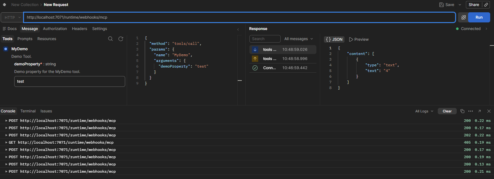

# Init

```
cd \r
func init DemoFuncApp --worker-runtime dotnet-isolated --target-framework net10.0
cd DemoFuncApp
func new --template "HTTP trigger" --name HttpExample
dotnet build
func start
```

# MCP Nuget in csproj

```
<PackageReference Include="Microsoft.Azure.Functions.Worker.Extensions.Mcp" Version="1.6.0" />
```

# New Simple Demo Tool in MyDemoTool.cs

```
using Microsoft.Azure.Functions.Worker;
using Microsoft.Azure.Functions.Worker.Extensions.Mcp;

namespace WeatherMcpSrvFuncApp;

/// <summary>
/// MCP tool that returns a string length.
/// </summary>
public class MyDemoTool()
{
	[Function(nameof(MyDemo))]
	public async Task<int> MyDemo(
		[McpToolTrigger(
			"MyDemo",
			"Demo Tool.")]
		ToolInvocationContext context,
		[McpToolProperty(
			"demoProperty",
			"Demo property for the MyDemo tool.",
			true)]
		string demoProperty)
	{
		return demoProperty.Length;
	}
}
```

# VS Code Init and Run

```
>Azure Functions: Initialize Project for Use with VS Code
>Azurite: Start

dotnet restore
dotnet build
func start
```

# Postman


