# Demystifying Microsoft Foundry Agents and MCP

See also [`docs/architecture.md`](../architecture.md) for runtime diagrams and production
settings.

## Foundry console demos (learning path)

Five standalone console apps in `Weather.sln` show how the production AI weather
path was built up, with **V5** as a hosted-agent contrast. They are **training
building blocks**, not deployables.
Run from VS Code (**Foundry Console V1** … **V5**) or `dotnet run` in each
folder. All use the `AZURE_FOUNDRY_PROD_EUS2_*` prefix (see each `.env.example`).

Suggested order: **V1 → V2 → V3 → V4 →** `GetCurrentAIWeatherHandler` in
`core-dotnet/core/AIWeather` **→ V5**.

- **V1 — Model-direct (legacy endpoint)** — [`FoundryConsoleV1`](../../FoundryConsoleV1)
  (`FoundryConsoleV1ModelDirectLegacy.csproj`)
  - Calls the model directly via legacy `AzureOpenAIClient` / Cognitive Services
    endpoint.
  - No agent; no MCP; demonstrates baseline chat completion against Foundry/OpenAI.
  - **Examples 1–2:** model-only — no Core weather data (ex 1 fails; ex 2 invents an answer).
  - **Examples 3–4:** console pre-fetches lat/long and weather from Core, injects JSON
    into the prompt, then calls the model (string out in ex 3; `AIWeatherResponse` JSON in ex 4).

  Examples 1–2 (model only):

  ```mermaid
  sequenceDiagram
      autonumber
      participant Console
      participant Model as Foundry Model

      Console->>Model: weather question (location)
      Model-->>Console: unreliable text
  ```

  Examples 3–4 (console-driven Core prep, then model):

  ```mermaid
  sequenceDiagram
      autonumber
      participant Console
      participant GetLatLong
      participant GetPublicWeather
      participant Model as Foundry Model

      Console->>GetLatLong: GetLatLong(location)
      GetLatLong-->>Console: NonAILatLongResponse
      Console->>GetPublicWeather: GetPublicWeather(lat,long)
      GetPublicWeather-->>Console: NonAIWeatherResponse
      Console->>Model: prompt + weather JSON
      Model-->>Console: text (ex 3) or AIWeatherResponse (ex 4)
  ```

- **V2 — Model-direct (unified AI endpoint)** — [`FoundryConsoleV2`](../../FoundryConsoleV2)
  (`FoundryConsoleV2ModelDirectUnifiedAI.csproj`)
  - Same idea as V1 but uses `ResponsesClient` against the unified AI services
    endpoint.
  - Shows the newer Foundry / Azure AI inference surface.

- **V3 — In-process tool callbacks** — [`FoundryConsoleV3`](../../FoundryConsoleV3)
  (`FoundryConsoleV3InjectFunctions.csproj`)
  - Registers `GetLatLongData` and `GetPublicWeatherData` as in-process tool
    callbacks (same tools `Core` exposes).
  - Model chooses tools locally; no remote MCP servers yet.

  ```mermaid
  sequenceDiagram
      autonumber
      participant UI
      box API
          participant API
          participant GetPublicWeatherFunc
          participant GetLatLongFunc
      end
      participant Model as Foundry Model

      UI->>API: GetPublicWeather(location)
      API->>Model: GetPublicWeather(location)
      Model->>GetLatLongFunc: GetLatLong(location)
      GetLatLongFunc-->>Model: NonAILatLongResponse
      Model->>GetPublicWeatherFunc: GetPublicWeather(lat,long)
      GetPublicWeatherFunc-->>Model: NonAIWeatherResponse
      Model-->>API: AIWeatherResponse
      API-->>UI: AIWeatherResponse
  ```

- **V4 — Model-direct + remote MCP tools** — [`FoundryConsoleV4`](../../FoundryConsoleV4)
  (`FoundryConsoleV4MCP.csproj`)
  - Same model-direct call as V3, but the tools are **remote MCP servers**
    declared on the request instead of in-process callbacks — no agent, and no
    Foundry-specific client.
  - The service calls the MCP servers itself, so V3's tool-call loop disappears.
  - Shows that MCP tooling does not require a Foundry agent.
  - Same pattern as production `GetCurrentAIWeatherHandler` in API/MVC.

  ```mermaid
  sequenceDiagram
      autonumber
      participant Console
      participant Model as Foundry Model
      box MCP Function
          participant GetLatLongTool
      end
      box MCP DotNet
          participant GetPublicWeatherTool
      end

      Console->>Model: system prompt + user prompt + MCP tools
      Model->>GetLatLongTool: GetLatLong(location)
      GetLatLongTool-->>Model: NonAILatLongResponse
      Model->>GetPublicWeatherTool: GetPublicWeather(lat,long)
      GetPublicWeatherTool-->>Model: NonAIWeatherResponse
      Model-->>Console: AIWeatherResponse
  ```

- **V5 — Hosted Foundry agent + MCP** — [`FoundryConsoleV5`](../../FoundryConsoleV5)
  (`FoundryConsoleV5Agent.csproj`)
  - Agent-hosted alternative to V4: calls a **hosted Foundry agent**
    (`wx1116-agent-default` by default).
  - Instructions, response schema, and MCP tools (`mcp-function`, `mcp-dotnet`)
    are configured on the agent in Azure.
  - The console sends **only the user prompt** — Responses `instructions` and
    `text` fields are rejected when an agent is specified.
  - **V5-only settings** (same `AZURE_FOUNDRY_PROD_EUS2_*` prefix as V1–V4):
    - `AZURE_FOUNDRY_PROD_EUS2_PROJ_URL` (required) — Foundry project URL.
    - `AZURE_FOUNDRY_PROD_EUS2_AGENT_NAME` (optional) — defaults to
      `wx1116-agent-default`.
    - `AZURE_FOUNDRY_PROD_EUS2_KEY` (required) — same API key as V1–V3.

## Brainstorm: demystifying model, agent, tools, and MCP

Scratchpad for presentation ideas. Diagrams progress from **model-only** → **agent
wraps model** → **tools (local or MCP)** → **agents calling agents**. Mix of
sequence, flow, and block views — steal whichever framing lands in the room.

Legend used throughout:

| Term | Meaning in these sketches |
| --- | --- |
| **Model / LLM** | The inference engine (tokens in → tokens out). No memory of your app unless you send it. |
| **Agent** | Hosted or in-process **orchestration layer**: instructions, thread state, tool routing, policies. Contains or calls a model. |
| **Tool** | A callable capability (function, API, script) the model can request. |
| **MCP** | A **protocol** for exposing tools (and resources) to agents over a standard wire — not the tool itself. |
| **Worker** | Background process that runs jobs, dashboards, or long-running agent tasks outside the request path. |

---

### 1. Model only — nothing else

Bare chat completion. No agent runtime, no tools, no grounding.

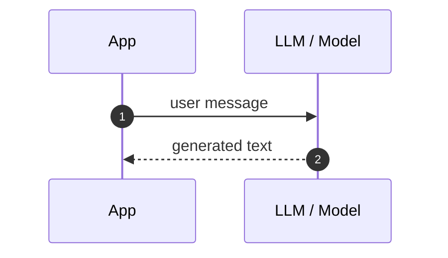

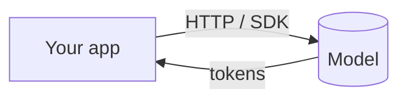

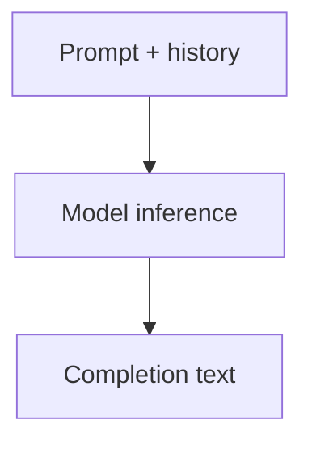

**Talk track:** “This is just the model. It only knows what you put in the prompt.”

---

### 2. Model only — why answers drift (weather example)

Same as V1 examples 1–2: no real data path.

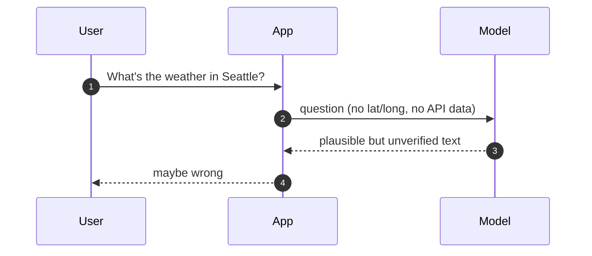

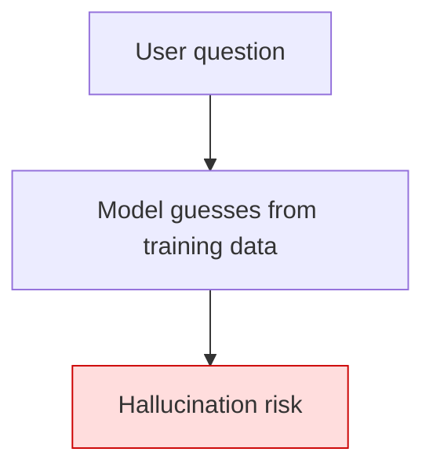

---

### 3. App does the work; model only narrates

Console pre-fetches data, then asks the model to format (V1 ex 3–4 pattern).

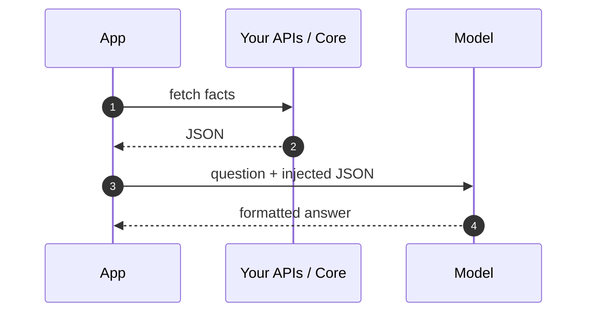

**Talk track:** “The model didn’t fetch anything — your code did. The model is a narrator.”

---

### 4. Agent wraps the model

The **agent** is the product surface: instructions, thread, policies. The model is
one component inside it.

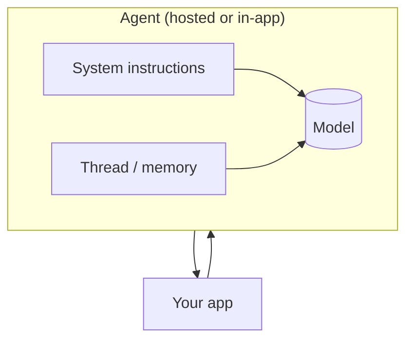

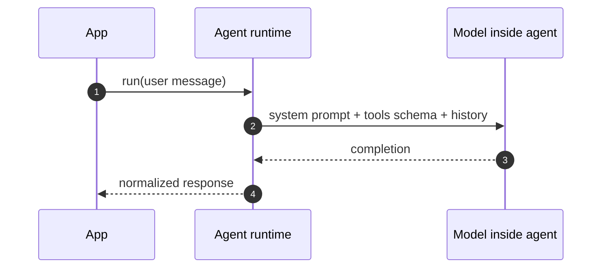

**Talk track:** “Calling the agent ≠ calling the model directly. The agent adds the
scaffolding.”

---

### 5. Same request — model-direct vs agent-hosted

Side-by-side mental model (V1–V4 / production vs V5).

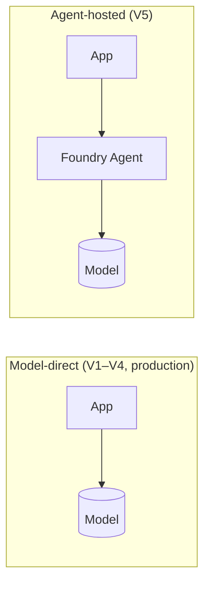

---

### 6. Model with tools — in-process (no MCP yet)

Function calling: the model **requests** a tool; your process **executes** it (V3).

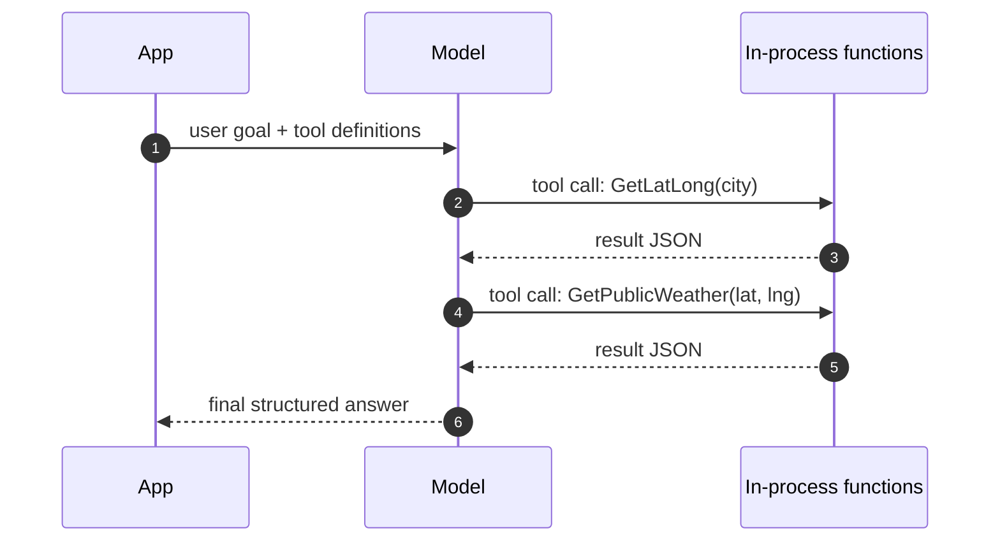

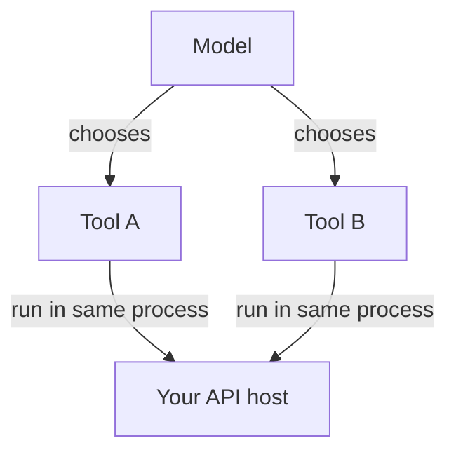

**Talk track:** “Tools are not magic — they’re functions the model is allowed to
name. Your code still runs them.”

---

### 7. Tool registry vs tool execution

Demystify “the model has tools” — it only has **schemas** until something executes.

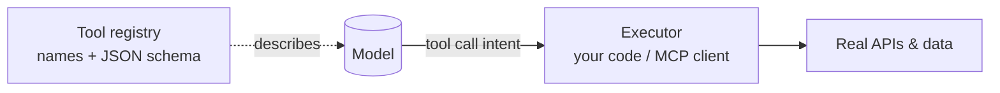

---

### 8. MCP enters — tools live on another server

MCP is the **wire** between agent runtime and tool hosts (this repo: `mcp-function`,
`mcp-dotnet`).

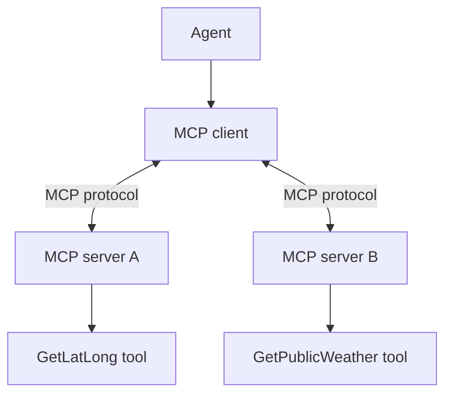

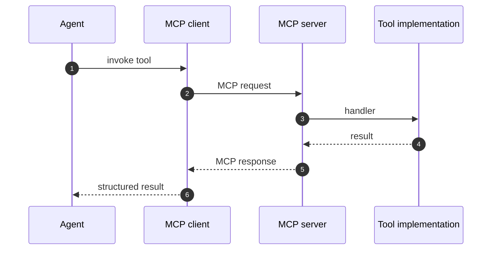

**Talk track:** “MCP doesn’t replace tools — it **standardizes** how agents discover
and call them across languages and hosts.”

---

### 9. Weather production path (model-direct + two MCP hosts)

Matches V4 and live API/MVC handler.

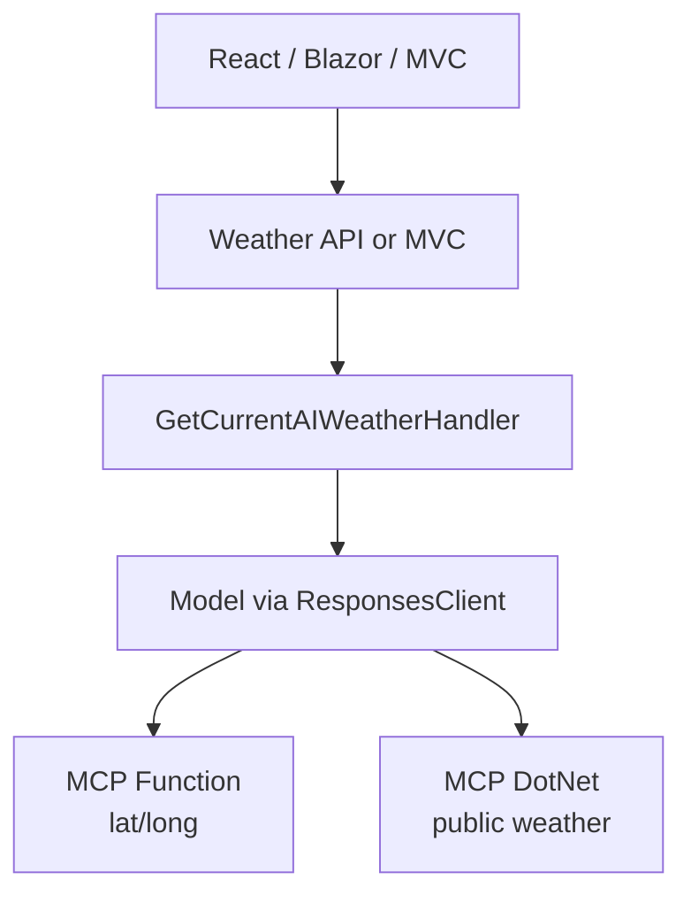

---

### 10. Agent contains model; model never talks to MCP directly

Clarifies who owns the loop.

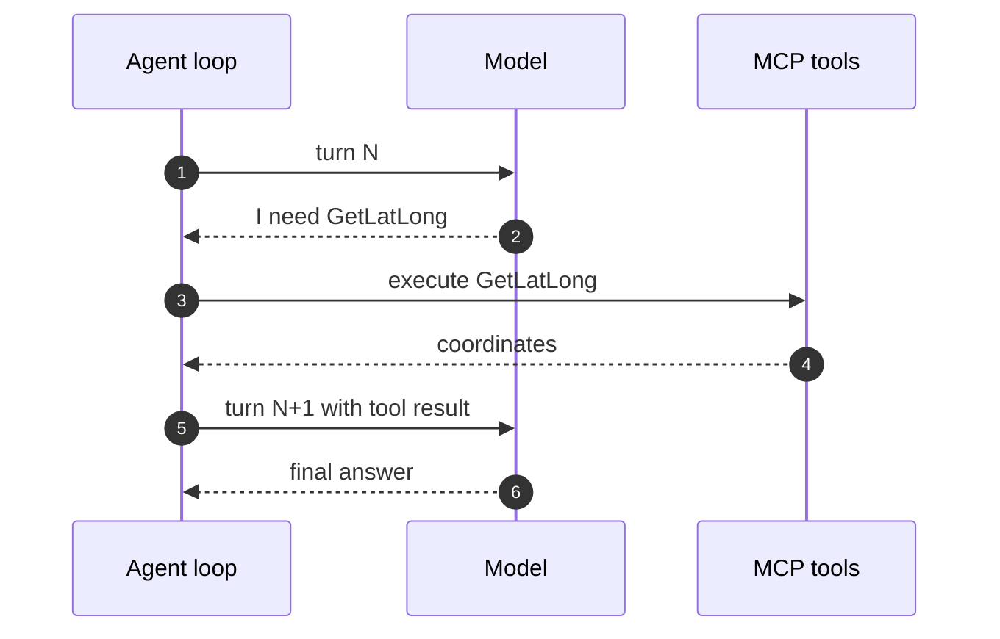

---

### 11. Layers stack — where each concept sits

Good single-slide “onion” for executives.

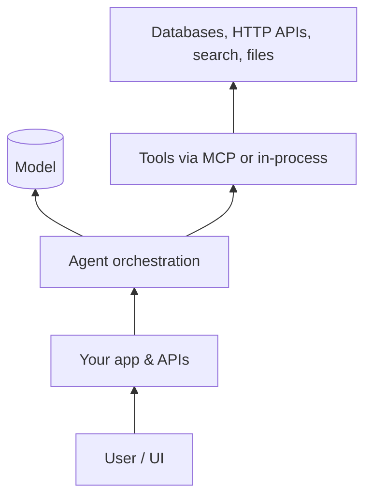

---

### 12. Terminology map — same words, different boxes

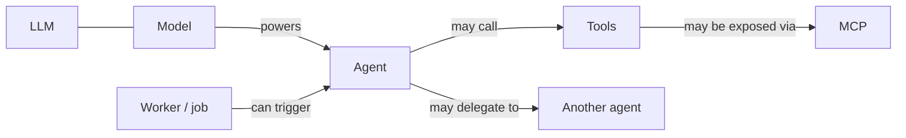

---

### 13. Specialist agents — one orchestrator, many models

Copilot-style pattern: router agent picks a sub-agent; each sub-agent has its own
model and toolset.

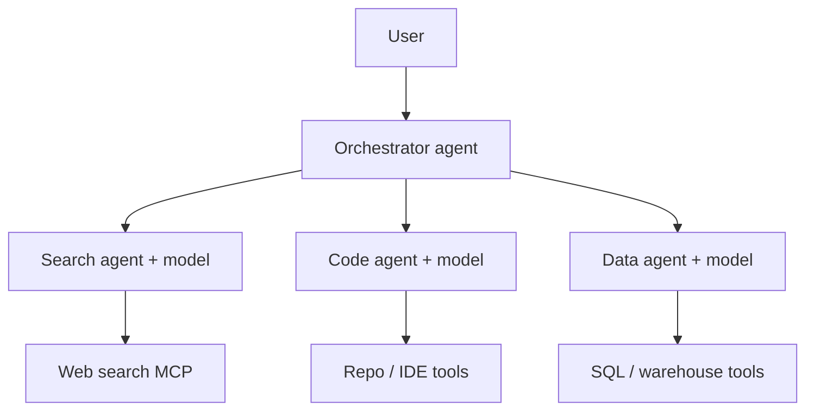

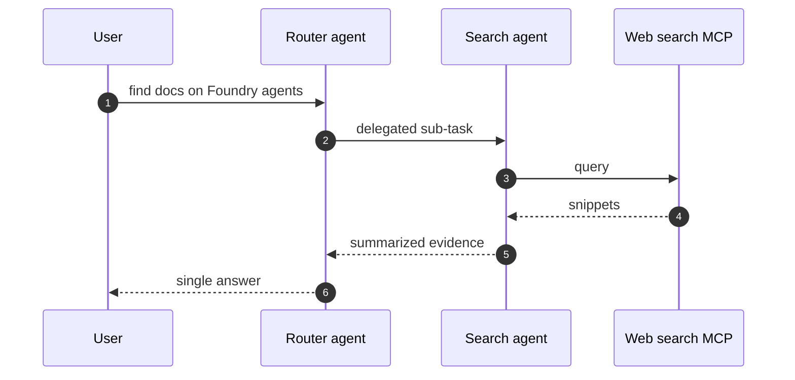

**Talk track:** “It’s agents all the way down — but each layer has a **job**, not
just another chat window.”

---

### 14. Agent calls agent calls agent (depth limit in practice)

Recursive delegation — platforms usually cap depth and add tracing.

```mermaid
flowchart TD
    A0[Top agent] --> A1[Planner agent]
    A1 --> A2[Research agent]
    A2 --> A3[Tool-runner agent]
    A3 --> MCP[MCP tools]
    A1 --> A4[Writer agent]
    A4 --> A0
```

```mermaid
sequenceDiagram
    autonumber
    participant A as Agent A
    participant B as Agent B
    participant C as Agent C
    participant T as Tools

    A->>B: subgoal
    B->>C: smaller subgoal
    C->>T: tool calls
    T-->>C: results
    C-->>B: partial answer
    B-->>A: merged answer
```

---

### 15. Map tool **references** to real MCP endpoints

How configuration binds abstract names to servers (Foundry agent tool list).

```mermaid
flowchart LR
    subgraph Config["Agent configuration"]
        R1[tool ref: latlong]
        R2[tool ref: weather]
    end
    subgraph Runtime["At runtime"]
        R1 --> S1[mcp-function host]
        R2 --> S2[mcp-dotnet host]
    end
```

---

### 16. Worker in the picture

Background job enqueues work; agent runs outside the browser request (Hangfire /
worker-dotnet angle).

```mermaid
sequenceDiagram
    autonumber
    participant UI
    participant API
    participant HF as Hangfire / queue
    participant Worker
    participant Agent as Foundry Agent

    UI->>API: schedule AI job
    API->>HF: enqueue
    HF->>Worker: execute job
    Worker->>Agent: long-running task
    Agent-->>Worker: result
    Worker-->>API: persist / notify
```

```mermaid
flowchart LR
    REQ[Interactive request] --> API[API]
    API --> AG[Agent now]
    API --> Q[Job queue]
    Q --> W[Worker]
    W --> AG2[Agent later]
```

---

### 17. Human in the loop

Agent proposes; human approves before dangerous tools run.

```mermaid
sequenceDiagram
    autonumber
    participant User
    participant App
    participant Agent
    participant Model
    participant Tool as Sensitive tool

    User->>App: request
    App->>Agent: run
    Agent->>Model: plan
    Model-->>Agent: propose tool call
    Agent-->>App: approval required
    App-->>User: confirm?
    User->>App: yes
    App->>Agent: approved
    Agent->>Tool: execute
    Tool-->>Agent: result
    Agent-->>User: outcome
```

---

### 18. RAG + agent + tools (three different “knowledge” sources)

```mermaid
flowchart TD
    Q[Question] --> AG[Agent]
    AG --> M[(Model)]
    AG --> RAG[(Vector / docs retrieval)]
    AG --> TOOLS[MCP & APIs]
    RAG -->|grounding| M
    TOOLS -->|live facts| M
    M --> A[Answer]
```

**Talk track:** RAG = static corpus; tools = live systems; model = reasoning over both.

---

### 19. Failure modes — what breaks each layer

```mermaid
flowchart TD
    M1[Model-only] --> F1[Hallucination]
    M2[Model + wrong tools] --> F2[Wrong tool chosen]
    M3[MCP down] --> F3[Agent errors / retries]
    M4[Agent misconfigured] --> F4[Tool refs point nowhere]
    M5[Too many sub-agents] --> F5[Latency / cost / loops]
```

---

### 20. One slide — full Weather journey V1 → V5 as maturity ladder

```mermaid
flowchart LR
    V1[V1 Model only] --> V2[V2 Unified endpoint]
    V2 --> V3[V3 In-process tools]
    V3 --> V4[V4 Model-direct + MCP]
    V4 --> PROD[API / MVC production handler]
    V4 --> V5[V5 Hosted agent contrast]

    V1 -.->|risk| H[Ungrounded answers]
    V3 -.->|better| T[Model picks tools]
    V4 -.->|ops| O[Remote MCP tools]
    V5 -.->|contrast| A[Agent owns config]
```

---

### 21. Optional: “Copilot workspace” style — many MCP tool families

```mermaid
flowchart TB
    U[User prompt] --> CP[Copilot-class orchestrator]
    CP --> M0[(Router model)]
    CP --> AG1[Browser agent]
    CP --> AG2[GitHub agent]
    CP --> AG3[Enterprise search agent]
    AG1 --> MCP1[Web / browse MCP]
    AG2 --> MCP2[GitHub MCP]
    AG3 --> MCP3[SharePoint / Graph MCP]
    AG1 & AG2 & AG3 --> SYN[Synthesis agent + model]
    SYN --> U
```

---

### 22. Optional: compare **function** vs **MCP tool** (same capability, two hosts)

```mermaid
flowchart TD
    subgraph V3["V3 — in-process tool callbacks"]
        M3[(Model)] --> F3[Functions in API process]
    end
    subgraph V4["V4 — MCP tools"]
        A4[Agent] --> M4[(Model)]
        A4 --> MC[MCP]
        MC --> F4[Functions in MCP server]
    end
```

**Talk track:** Same `GetLatLong` idea; V4 moves execution to a **standard remote
tool host** the agent already knows how to call.

---

_Pick 3–5 diagrams per audience: executives → 11, 12, 20; engineers → 6, 8, 10,
13; live demo → 9, 14, 22._

---

## Microsoft reference

[Azure AI Foundry Agents overview](https://learn.microsoft.com/en-us/azure/foundry/agents/overview)


