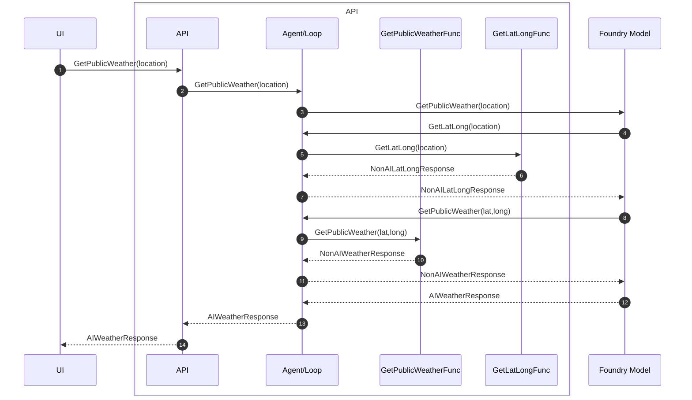

# Tool callback diagram (with looping)

Companion to [`demystifying-foundry-agents-mcp.md`](demystifying-foundry-agents-mcp.md) and
[`demystifying-model-agent-tools-mcp-brainstorming.md`](demystifying-model-agent-tools-mcp-brainstorming.md).

End-to-end sequence for **in-process tool callbacks**: the agent/loop owns the turn
cycle — the model requests tools, the app executes them, results go back to the model
until a final answer is produced.

## Tool callback diagram (with looping)

