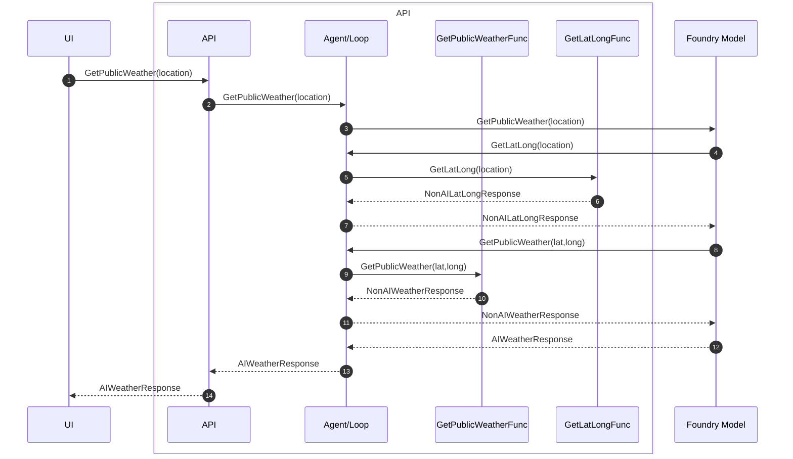
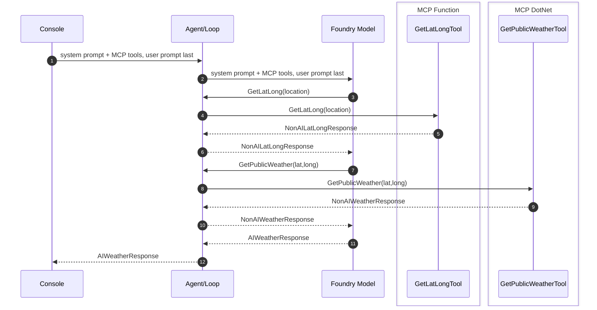

# Looping diagrams — tool callbacks and MCP

Companion to [`demystifying-foundry-agents-mcp.md`](demystifying-foundry-agents-mcp.md) and
[`demystifying-model-agent-tools-mcp-brainstorming.md`](demystifying-model-agent-tools-mcp-brainstorming.md).

End-to-end sequences where the **agent/loop** owns the turn cycle: the model requests
tools, the app or MCP host executes them, results go back to the model until a final
answer is produced.

## Tool callback diagram (with looping)

## Agent to MCP (with looping)

