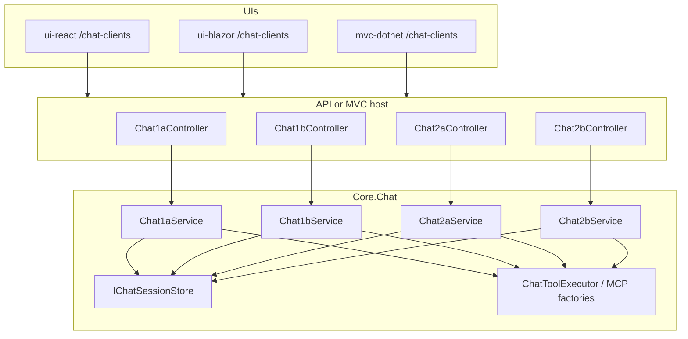

# Chat Clients (Chat1a–Chat2b)

Standalone multi-turn chat in all three UIs (React, MVC, Blazor). This feature is **separate**
from the existing **Current AI Weather** widget (`/AIWeather/Current`), which remains a
one-shot structured JSON response.

## The 2×2 matrix

| Tab | Stack | Tools | Maps to console demo |
| --- | --- | --- | --- |
| **Chat1a** | Responses API (model-direct) | In-process (`GetLatLongData`, `GetPublicWeatherData`) | Foundry Console **V3** |
| **Chat1b** | Responses API (model-direct) | Remote MCP (`mcp-srv-func-app`, `mcp-srv-app-service`) | Foundry Console **V4** |
| **Chat2a** | Microsoft Agent Framework (model-direct) | In-process tools via `AIFunctionFactory` | V3 orchestration style |
| **Chat2b** | Microsoft Agent Framework (model-direct) | Remote MCP via `HostedMcpServerTool` | V4 orchestration style |

Each tab has its **own controller**, **own Core service**, and **own session namespace**
(`Chat1a:…`, `Chat1b:…`, etc.) so implementations do not collide.

## Architecture



### Request flow

1. UI posts `POST /Chat1a/messages` (or `Chat1b`, `Chat2a`, `Chat2b`) with JSON:
   `{ "sessionId": "optional", "message": "user text" }`
2. Server returns **Server-Sent Events** (`text/event-stream`) with JSON payloads:
   - `session` — assigns or confirms session id
   - `token` — streamed assistant text delta
   - `tool_start` / `tool_end` — tool invocation status
   - `error` — failure message
   - `done` — turn complete
3. Core stores conversation history per session in `InMemoryChatSessionStore` (demo-friendly;
   replace with Redis/SQL for production).

### React / Blazor vs MVC

| UI | Chat page | Backend |
| --- | --- | --- |
| React | `/chat-clients` | Proxies to Weather API (`VITE_API_DOTNET_URL`) |
| Blazor | `/chat-clients` | `ChatApiClient` → Weather API |
| MVC | `/chat-clients` | Local controllers + Core (same as API handlers) |

The chat panel lives on `/chat-clients`. Hello and Current AI Weather are
separate pages (`/hello-world`, `/current-ai-weather`).

## Core layout

```
core-dotnet/core/Chat/
  Models/                 ChatMessage, ChatSendMessageRequest, ChatStreamEvent
  Services/               session store, tool executor, MCP factories, Foundry settings
  Chat1a/Chat1aService.cs
  Chat1b/Chat1bService.cs
  Chat2a/Chat2aService.cs
  Chat2b/Chat2bService.cs
  ChatServiceCollectionExtensions.cs
```

Register in API/MVC:

```csharp
builder.Services.AddWeatherChatClients();
```

## Tools (no web search)

All four tabs expose the same two weather tools (no web search):

| Tool | Purpose |
| --- | --- |
| `GetLatLongData` | Resolve a place name to coordinates |
| `GetPublicWeatherData` | Fetch current weather for lat/long |

- **In-process (Chat1a, Chat2a):** Core `ChatToolExecutor` runs MediatR handlers when the model
  emits function calls (V3 loop for Responses; Agent Framework tool loop for Chat2a).
- **MCP (Chat1b, Chat2b):** Remote MCP hosts (`mcp-srv-func-app`, `mcp-srv-app-service`) — platform invokes
  tools; no local function-call loop in Chat1b.

**Chat2a/Chat2b memory:** `IChatSessionStore` only tracks session ids and a display audit trail
(user/assistant text). Multi-turn context for Agent Framework tabs comes from `AgentSession`
(`ChatAgentSessionStore`), not from replaying `IChatSessionStore` history.

## Configuration

Same Foundry settings as AI Weather and Foundry consoles:

| Variable | Used by |
| --- | --- |
| `AZURE_FOUNDRY_PROD_EUS2_PROJ_URL` | All chat tabs |
| `AZURE_FOUNDRY_PROD_EUS2_KEY` | All chat tabs |
| `AZURE_FOUNDRY_PROD_EUS2_MODEL` | All chat tabs |
| `MCP_SRV_FUNC_APP_URL`, `MCP_SRV_FUNC_APP_KEY` | Chat1b, Chat2b |
| `MCP_SRV_APP_SERVICE_URL`, `MCP_SRV_APP_SERVICE_KEY` | Chat1b, Chat2b |

Chat1a and Chat2a do **not** require MCP URLs.

## Differences from Current AI Weather

| | Current AI Weather | Chat clients |
| --- | --- | --- |
| Endpoint | `GET /AIWeather/Current` | `POST /Chat1a/messages`, etc. |
| Output | Strict `AIWeatherResponse` JSON | Conversational text (streamed) |
| Memory | None (single shot) | Per-tab session history |
| UI | `/current-ai-weather` page | `/chat-clients` chat panel (four tabs, per-tab session) |

## Learning goals

- **Chat1a vs Chat1b:** Same Responses API; compare in-process tool loop vs MCP.
- **Chat2a vs Chat2b:** Same Agent Framework; compare in-process vs hosted MCP tools.
- **Chat1a vs Chat2a:** Same in-process tools; compare raw Responses orchestration vs framework
  sessions and `RunStreamingAsync`.

## Related docs

- [`docs/4-demystifying-foundry-agents-mcp/demystifying-foundry-agents-mcp.md`](../4-demystifying-foundry-agents-mcp/demystifying-foundry-agents-mcp.md) — V3/V4 console demos
- [`docs/architecture.md`](../architecture.md) — runtime map including chat clients
- [`docs/presentation.md`](../presentation.md) — talk index
