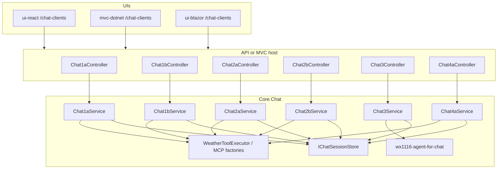

# Chat Clients (Chat1a–Chat2b, Chat3, and Chat4a)

Standalone multi-turn chat in all three UIs (React, MVC, Blazor). This feature is **separate**
from the existing **Current AI Weather** widget (`/AIWeather/CurrentV3`, `/CurrentV4`, or
`/CurrentV5` - V3/V4/V5 tabs on `/current-ai-weather`, V3 only on `/weather`), which remains
a one-shot structured JSON response.

## The matrix

| Tab | Stack | Tools | Maps to console demo |
| --- | --- | --- | --- |
| **Chat1a** | Responses API (model-direct) | In-process (`GetLatLong`, `GetLocation`, `GetPublicWeatherCurrent`, `GetPublicWeatherForecast`, `GetPublicWeatherHistory`) | Foundry Console **V3** |
| **Chat1b** | Responses API (model-direct) | Remote MCP (`mcp-srv-func-app`, `mcp-srv-app-service`) | Foundry Console **V4** |
| **Chat2a** | Microsoft Agent Framework (model-direct) | In-process tools via `AIFunctionFactory` | V3 orchestration style |
| **Chat2b** | Microsoft Agent Framework (model-direct) | Remote MCP via `HostedMcpServerTool` | V4 orchestration style |
| **Chat3** | Hosted Microsoft Foundry agent | MCP tools configured **on the agent** in Foundry (`wx1116-agent-for-chat`) | Foundry Console **V5** |
| **Chat4a** | Microsoft Agent Framework (model-direct), multi-agent | In-process tools, split across two sub-agents delegated to by an orchestrator via `AsAIFunction` | Multi-agent extension of V3 orchestration style |

Each tab has its **own controller**, **own Core service**, and **own session namespace**
(`Chat1a:…`, `Chat1b:…`, `Chat3:…`, `Chat4a:…`, etc.) so implementations do not collide.

Chat1/Chat2 still send the model name, instructions, and tools from this repo.
**Chat3 does not** — it calls `GetProjectResponsesClientForAgent` and sends only the
user prompt, the same way Foundry Console V5 does.

## Architecture



### Request flow

1. UI posts `POST /Chat1a/messages` (or `Chat1b`, `Chat2a`, `Chat2b`, `Chat3`, `Chat4a`) with JSON:
   `{ "sessionId": "optional", "message": "user text" }`
2. Server returns **Server-Sent Events** (`text/event-stream`) with JSON payloads:
   - `session` — assigns or confirms session id
   - `token` — streamed assistant text delta
   - `tool_start` / `tool_end` — tool invocation status (when the stream surfaces MCP calls)
   - `error` — failure message
   - `done` — turn complete; includes `usage` (`runtimeMs` plus token counts when the model reported them)
3. Core stores conversation history per session in `InMemoryChatSessionStore` (demo-friendly;
   replace with Redis/SQL for production).

### React / Blazor vs MVC

| UI | Chat page | Backend |
| --- | --- | --- |
| React | `/chat-clients` | Proxies to Weather API (`VITE_API_DOTNET_URL`) |
| Blazor | `/chat-clients` | `ChatApiClient` → Weather API |
| MVC | `/chat-clients` | Local controllers + Core (same as API handlers) |

The chat panel lives on `/chat-clients`. Hello and Current AI Weather are
separate pages (`/hello-world`, `/current-ai-weather`).

## Core layout

```
core-dotnet/core/Chat/
  Models/                 ChatMessage, ChatSendMessageRequest, ChatStreamEvent
  Services/               session store, MCP factories, Foundry settings
  Chat1a/Chat1aService.cs
  Chat1b/Chat1bService.cs
  Chat2a/Chat2aService.cs
  Chat2b/Chat2bService.cs
  Chat3/Chat3Service.cs
  Chat4a/Chat4aService.cs
  ChatServiceCollectionExtensions.cs
```

Register in API/MVC:

```csharp
builder.Services.AddWeatherChatClients();
```

## Tools (no web search)

Chat1 and Chat2 expose the same public geo and weather tools from this repo (no web search).
Chat3 uses the **same tool names**, but they are attached to `wx1116-agent-for-chat` in Foundry,
not declared on the request.

| Tool | Purpose |
| --- | --- |
| `GetLatLong` | Resolve a place name to ranked coordinates (default top 5) |
| `GetLocation` | Reverse-geocode lat/long to a place label |
| `GetPublicWeatherCurrent` | Fetch current weather for lat/long |
| `GetPublicWeatherForecast` | Upcoming forecast: Daily (7 days), Hourly (48 hours), or FifteenMinutes (48 hours) |
| `GetPublicWeatherHistory` | Recent past: Daily (previous 7 days) or Hourly (previous 48 hours) |

- **In-process (Chat1a, Chat2a):** Core `WeatherToolExecutor` runs CQMediator handlers when the model
  emits function calls (V3 loop for Responses; Agent Framework tool loop for Chat2a).
- **MCP (Chat1b, Chat2b):** Remote MCP hosts (`mcp-srv-func-app`, `mcp-srv-app-service`) — platform invokes
  tools; no local function-call loop in Chat1b.
- **Hosted agent (Chat3):** Foundry invokes those MCP hosts. This app does not send tools, instructions,
  or a model name.

**Chat2a/Chat2b memory:** `IChatSessionStore` only tracks session ids and a display audit trail
(user/assistant text). Multi-turn context for Agent Framework tabs comes from `AgentSession`
(`ChatAgentSessionStore`), not from replaying `IChatSessionStore` history.

**Chat3 memory:** later turns send `previous_response_id` (`ChatHostedAgentResponseStore`). Chat3
does **not** replay a system prompt — Foundry rejects `instructions` when an agent is specified.

**Chat4a memory:** only the orchestrator (Helm) has a persistent `AgentSession` via
`ChatAgentSessionStore`, exactly like Chat2a. The two sub-agents (Fix, Baro) are rebuilt on every
request and invoked with `session: null` — they are stateless, single-purpose "query in, text out"
tools with no memory of their own; Helm is the only agent that remembers prior turns.

## Chat4a: multi-agent orchestration (Fix / Baro / Helm)

Chat4a restructures Chat2a's single flat-tool agent into a small multi-agent system. Three
`AIAgent` instances are built per request in `Chat4aService`, each with a fixed nickname kept in
a `// Agent <name> 👤` comment directly above its construction so the three names stay
unambiguous in code:

- **Agent Fix 👤** — geo sub-agent. Owns exactly `GetLatLong` and `GetLocation`.
- **Agent Baro 👤** — weather sub-agent. Owns exactly `GetPublicWeatherCurrent`,
  `GetPublicWeatherForecast`, and `GetPublicWeatherHistory`.
- **Agent Helm 👤** — orchestrator. Has no geo/weather tools of its own; its only two tools
  *are* Fix and Baro, wrapped via `AIAgentExtensions.AsAIFunction` (`Microsoft.Agents.AI` 1.20.0,
  already referenced by this repo — no `Microsoft.Agents.AI.Workflows` package is used or needed
  for this two-agent delegation). Helm decides when to call Fix, when to call Baro, and passes
  Fix's resolved coordinates into Baro's request.

**Nested tool calls are not individually traced.** Helm's SSE stream shows `tool_start`/`tool_end`
for the two delegation calls ("Fix", "Baro") the same way Chat2a shows its five direct tool calls.
Fix's and Baro's own inner tool calls (e.g. Fix calling `GetLatLong`) happen inside the synchronous
function body `AsAIFunction` generates and do not produce separate stream events — the UI shows
"Helm called Fix" → "Fix returned an answer", not the geocoding call nested inside Fix. This is an
intentional scope boundary for this tab, not a bug.

## Configuration

Same Foundry settings as AI Weather and Foundry consoles, plus the Chat3 agent name:

| Variable | Used by |
| --- | --- |
| `AZURE_FOUNDRY_PROD_EUS2_PROJ_URL` | All chat tabs |
| `AZURE_FOUNDRY_PROD_EUS2_KEY` | All chat tabs |
| `AZURE_FOUNDRY_PROD_EUS2_MODEL` | Chat1a–Chat2b (not Chat3) |
| `AZURE_FOUNDRY_PROD_EUS2_CHAT_AGENT_NAME` | Chat3 only (required). GitHub var / App Service. Independent of V5's `AZURE_FOUNDRY_PROD_EUS2_AGENT_NAME`. |
| `MCP_SRV_FUNC_APP_URL`, `MCP_SRV_FUNC_APP_KEY` | Chat1b, Chat2b |
| `MCP_SRV_APP_SERVICE_URL`, `MCP_SRV_APP_SERVICE_KEY` | Chat1b, Chat2b |

Chat1a and Chat2a do **not** require MCP URLs. Chat3 does **not** require MCP URLs in the app
either — those belong on the hosted agent.

`AZURE_FOUNDRY_PROD_EUS2_AGENT_NAME` remains the V5 console agent (`wx1116-agent-for-current-weather`,
JSON weather). Do not point Chat3 at that agent.

## Create the Chat3 Foundry agent (`wx1116-agent-for-chat`)

This is a **hosted Foundry Agent** (prompt agent), not a new model deployment and not a
new SDK “client” type. The code already has a `ProjectResponsesClient` that *targets* the
agent by name. You create the agent in the Foundry project; Chat3 then calls it the same
way V5 calls `wx1116-agent-for-current-weather`.

`wx1116-agent-for-chat` is a good name: it sits next to `wx1116-agent-for-current-weather` and says this
one is the conversational chat agent.

Do **not** clone `wx1116-agent-for-current-weather` as-is. That agent owns a strict `AIWeatherResponse`
JSON schema for the one-shot V5 / Current AI Weather path. Chat3 needs free-form Markdown.

### Automated publish

Do not create Chat3 (or V5) by hand. `prod-provision-infra.yml` registers the
two MCP hosts as Foundry **RemoteTool** connections (`MyMcpSrvAppService`,
`MyMcpSrvFuncApp`). `prod-deploy-foundry-agents.yml` then publishes
`wx1116-agent-for-chat` (and `wx1116-agent-for-current-weather`) against those
connections with `require_approval: never`. Instructions live in
`.github/foundry-agents/`.

### Portal fallback

Only if you need to inspect or repair a published version:

1. Open the Microsoft Foundry portal for the same project as
   `AZURE_FOUNDRY_PROD_EUS2_PROJ_URL`.
2. **Agents** → `wx1116-agent-for-chat` (must match `AZURE_FOUNDRY_PROD_EUS2_CHAT_AGENT_NAME`).
3. Confirm the model is the same deployment as `AZURE_FOUNDRY_PROD_EUS2_MODEL`
   (for example `gpt-5.4-mini`).
4. **Instructions:** the Chat3 text below (same as
   `ChatSystemInstructions.WeatherAssistant` /
   `.github/foundry-agents/wx1116-agent-for-chat.instructions.md`).
5. **Response format:** text / none. Do **not** attach a JSON schema.
6. **Tools:** the two MCP connections above, **Approval** = **Never**.
   Chat3 does not round-trip approvals in app code (same as V5).
7. Chat3 calls the agent **by name** (project default version).

### MCP tools on the agent

Match the labels Chat1b already uses so traces stay comparable:

| `server_label` | `server_url` | Auth | Tools the server exposes |
| --- | --- | --- | --- |
| `McpSrvFuncApp` | `https://<prod-mcp-srv-func-app>/runtime/webhooks/mcp` | Header `x-functions-key` = Functions `mcp_extension` system key (`MCP_SRV_FUNC_APP_KEY`) | `GetLatLong`, `GetLocation` |
| `McpSrvAppService` | `https://<prod-mcp-srv-app-service>/mcp` | Header `Authorization` = `Bearer <MCP_SRV_APP_SERVICE_KEY>` | `GetPublicWeatherCurrent`, `GetPublicWeatherForecast`, `GetPublicWeatherHistory` |

Production host names are in [`docs/architecture.md`](../architecture.md) (MCP Tool Hosts).
Auth headers live on the Foundry **RemoteTool** connections, not on the agent.

Equivalent MCP tool JSON (approval never; secrets come from the IaC
connections, not from headers on the agent):

```json
[
  {
    "type": "mcp",
    "server_label": "McpSrvFuncApp",
    "server_url": "https://<prod-mcp-srv-func-app>/runtime/webhooks/mcp",
    "project_connection_id": "MyMcpSrvFuncApp",
    "require_approval": "never"
  },
  {
    "type": "mcp",
    "server_label": "McpSrvAppService",
    "server_url": "https://<prod-mcp-srv-app-service>/mcp",
    "project_connection_id": "MyMcpSrvAppService",
    "require_approval": "never"
  }
]
```

### Instructions to paste

```
You are a helpful weather assistant in a multi-turn chat.
Use U.S. customary units only: °F, mph, and " (e.g. 72°F, 8 mph, 1"). Convert from the weather tool's native units (°C, km/h, mm). Do not present C, KPH, or MM in responses.
You have tools to resolve locations to ranked coordinates, turn coordinates into a place label, and fetch public weather.
GetLatLong returns up to 5 matches (rank 1 is best); use state and country if you need to skip rank 1.
GetLocation reverse-geocodes latitude/longitude to City, State in the US, or City, State, Country elsewhere. If that is unavailable it returns a feature name, then a formatted coordinate such as 35.51° N, 86.58° W — use it instead of guessing the place name from coordinates.
GetPublicWeatherCurrent is conditions right now.
GetPublicWeatherForecast is upcoming weather: Daily (next 7 days), Hourly (next 48 hours), or FifteenMinutes (next 48 hours). Prefer Daily unless the user asks for hourly or 15-minute detail.
GetPublicWeatherHistory is recent past weather: Daily (previous 7 days) or Hourly (previous 48 hours). Prefer Daily unless the user asks for hourly detail.
Call those tools whenever you need real data instead of guessing.
Be conversational, concise, and helpful.
GitHub-flavored Markdown (bold, lists, tables, code) is allowed when it makes the answer easier to read. Do not emit raw HTML.
When you report current weather, use one or two friendly sentences and include the place name, temperature, wind speed, wind direction, and overall conditions. Keep those facts in the reply even if a tool also returned them as JSON.
When stating wind direction, use the meteorological source compass label from windDirectionSource (where the wind comes from), optionally with source degrees in parentheses (e.g. SW (224°)). Do not add 180 to degrees.
```

Keep this in sync with `core-dotnet/core/Chat/Services/ChatSystemInstructions.cs`.

## Differences from Current AI Weather

| | Current AI Weather | Chat clients |
| --- | --- | --- |
| Endpoint | `GET /AIWeather/CurrentV3`, `/CurrentV4`, or `/CurrentV5` | `POST /Chat1a/messages`, etc. |
| Output | Strict `AIWeatherResponse` JSON | Conversational text (streamed) |
| Memory | None (single shot) | Per-tab session history |
| UI | `/current-ai-weather` page | `/chat-clients` chat panel (six tabs, per-tab session) |

## Learning goals

- **Chat1a vs Chat1b:** Same Responses API; compare in-process tool loop vs MCP.
- **Chat2a vs Chat2b:** Same Agent Framework; compare in-process vs hosted MCP tools.
- **Chat1a vs Chat2a:** Same in-process tools; compare raw Responses orchestration vs framework
  sessions and `RunStreamingAsync`.
- **Chat2b vs Chat3:** Same remote MCP weather tools; Chat2b still defines the agent in-process,
  Chat3 uses the Foundry-defined agent.
- **Chat2a vs Chat4a:** Same in-process tools and same model-direct Agent Framework stack; Chat2a
  owns all five tools directly on one agent, Chat4a splits them across two narrowly-scoped
  sub-agents (Fix, Baro) delegated to by an orchestrator (Helm) via `AsAIFunction` — same
  capability, now visibly decomposed into a multi-agent shape.

## Related docs

- [`docs/4-demystifying-foundry-agents-mcp/demystifying-foundry-agents-mcp.md`](../4-demystifying-foundry-agents-mcp/demystifying-foundry-agents-mcp.md) — V3/V4/V5 console demos
- [`docs/architecture.md`](../architecture.md) — runtime map including chat clients
- [`docs/presentation.md`](../presentation.md) — talk index
