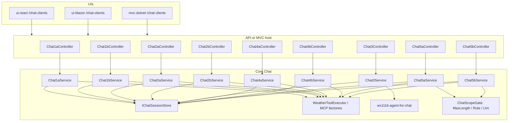

# Chat Clients (Chat1a–Chat2b, Chat3, Chat4a–Chat4b, and Chat5a–Chat5b)

Standalone multi-turn chat in all three UIs (React, MVC, Blazor). This feature is **separate**
from the existing **Current AI Weather** widget (`/AIWeather/CurrentV3`, `/CurrentV4`, or
`/CurrentV5` - V3/V4/V5 tabs on `/current-ai-weather`, V3 only on `/weather`), which remains
a one-shot structured JSON response.

## The matrix

| Tab | Stack | Tools | Maps to console demo |
| --- | --- | --- | --- |
| **Chat1a** | Responses API (model-direct) | In-process (`GetLatLong`, `GetLocation`, `GetPublicWeatherCurrent`, `GetPublicWeatherForecast`, `GetPublicWeatherHistory`) | Foundry Console **V3** |
| **Chat1b** | Responses API (model-direct) | Remote MCP (`mcp-srv-func-app`, `mcp-srv-app-service`, `mcp-srv-python`) | Foundry Console **V4** |
| **Chat2a** | Microsoft Agent Framework (model-direct) | In-process tools via `AIFunctionFactory` | V3 orchestration style |
| **Chat2b** | Microsoft Agent Framework (model-direct) | Remote MCP via `HostedMcpServerTool` | V4 orchestration style |
| **Chat3** | Hosted Microsoft Foundry agent | MCP tools configured **on the agent** in Foundry (`wx1116-agent-for-chat`) | Foundry Console **V5** |
| **Chat4a** | Microsoft Agent Framework (model-direct), multi-agent | In-process tools, split across two sub-agents delegated to by an orchestrator via `AsAIFunction` | Multi-agent extension of V3 orchestration style |
| **Chat4b** | Microsoft Agent Framework (model-direct), multi-agent | Remote MCP tools, split across two sub-agents delegated to by an orchestrator via `AsAIFunction` | Multi-agent extension of V4 orchestration style |
| **Chat5a** | Microsoft Agent Framework (model-direct), multi-agent, guardrailed | Chat4a's in-process tools, unchanged, plus five independently toggleable guardrail gates in front of/around the orchestrator | Teaching demo: securing a multi-agent system |
| **Chat5b** | Microsoft Agent Framework (model-direct), multi-agent, guardrailed | Chat4b's remote MCP tools, unchanged, plus the same five guardrail gates | Teaching demo: securing a multi-agent system |

Each tab has its **own controller**, **own Core service**, and **own session namespace**
(`Chat1a:…`, `Chat1b:…`, `Chat3:…`, `Chat4a:…`, `Chat4b:…`, `Chat5a:…`, `Chat5b:…`, etc.) so
implementations do not collide.

Chat1/Chat2 still send the model name, instructions, and tools from this repo.
**Chat3 does not** — it calls `GetProjectResponsesClientForAgent` and sends only the
user prompt, the same way Foundry Console V5 does.

## Architecture



### Request flow

1. UI posts `POST /Chat1a/messages` (or `Chat1b`, `Chat2a`, `Chat2b`, `Chat3`, `Chat4a`, `Chat4b`,
   `Chat5a`, `Chat5b`) with JSON: `{ "sessionId": "optional", "message": "user text" }`
   (Chat5a/Chat5b also accept the five `enable*Gate`/`enableSystemPromptGuard` flags — see
   [Chat5a/Chat5b](#chat5achat5b-guardrailed-multi-agent-orchestration-five-toggleable-gates) below)
2. Server returns **Server-Sent Events** (`text/event-stream`) with JSON payloads:
   - `session` — assigns or confirms session id
   - `token` — streamed assistant text delta
   - `tool_start` / `tool_end` — tool invocation status (when the stream surfaces MCP calls)
   - `blocked` — Chat5a/Chat5b only: a guardrail gate refused the request/response before or
     after the orchestrator ran
   - `error` — failure message
   - `done` — turn complete; includes `usage` (`runtimeMs` plus token counts when the model reported them)
3. Core stores conversation history per session in `InMemoryChatSessionStore` (demo-friendly;
   replace with Redis/SQL for production).

### React / Blazor vs MVC

| UI | Chat page | Backend |
| --- | --- | --- |
| React | `/chat-clients` | Proxies to Weather API (`VITE_API_DOTNET_URL`) |
| Blazor | `/chat-clients` | `ChatApiClient` → Weather API |
| MVC | `/chat-clients` | Local controllers + Core (same as API handlers) |

The chat panel lives on `/chat-clients`. Hello and Current AI Weather are
separate pages (`/hello-world`, `/current-ai-weather`).

## Core layout

```
core-dotnet/core/Chat/
  Models/                 ChatMessage, ChatSendMessageRequest, ChatStreamEvent
  Services/               session store, MCP factories, Foundry settings
  Chat1a/Chat1aService.cs
  Chat1b/Chat1bService.cs
  Chat2a/Chat2aService.cs
  Chat2b/Chat2bService.cs
  Chat3/Chat3Service.cs
  Chat4a/Chat4aService.cs
  Chat4b/Chat4bService.cs
  Chat5a/Chat5aService.cs
  Chat5b/Chat5bService.cs
  Services/ChatScopeGate/         IScopeGate, ChatScopeGateResult, MaxLengthScopeGate,
                                   RuleScopeGate, LlmScopeGate, ChatScopeGatePipeline
  ChatServiceCollectionExtensions.cs
```

Register in API/MVC:

```csharp
builder.Services.AddWeatherChatClients();
```

## Tools (no web search)

Chat1 and Chat2 expose the same public geo and weather tools from this repo (no web search).
Chat3 uses the **same tool names**, but they are attached to `wx1116-agent-for-chat` in Foundry,
not declared on the request.

| Tool | Purpose |
| --- | --- |
| `GetLatLong` | Resolve a place name to ranked coordinates (default top 5) |
| `GetLocation` | Reverse-geocode lat/long to a place label |
| `GetPublicWeatherCurrent` | Fetch current weather for lat/long |
| `GetPublicWeatherForecast` | Upcoming forecast: Daily (7 days), Hourly (48 hours), or FifteenMinutes (48 hours) |
| `GetPublicWeatherHistory` | Recent past: Daily (previous 7 days) or Hourly (previous 48 hours) |

- **In-process (Chat1a, Chat2a, Chat4a, Chat5a):** Core `WeatherToolExecutor` runs CQMediator handlers when the
  model emits function calls (V3 loop for Responses; Agent Framework tool loop for Chat2a and, inside
  Chat4a's/Chat5a's Geo and NonAI Weather sub-agents, for Chat4a/Chat5a).
- **MCP (Chat1b, Chat2b, Chat4b, Chat5b):** Remote MCP hosts (`mcp-srv-func-app`, `mcp-srv-app-service`,
  `mcp-srv-python`) — platform invokes tools; no local function-call loop in Chat1b. Chat4b's/Chat5b's Geo
  sub-agent gets only `mcp-srv-func-app`'s tool from `ChatHostedMcpToolFactory.CreateGeoTools()`;
  its NonAI Weather sub-agent gets both `mcp-srv-app-service`'s and `mcp-srv-python`'s tools from
  `CreateNonAiWeatherTools()` — not the combined three-tool list Chat1b/Chat2b use (which also
  includes Geo's tool).
- **Hosted agent (Chat3):** Foundry invokes those MCP hosts. This app does not send tools, instructions,
  or a model name.

Chat5a and Chat5b reuse Chat4a's and Chat4b's exact tool wiring verbatim — same Geo/NonAI Weather
sub-agents, same tool sets, same `AsAIFunction` delegation. The five guardrail gates (see below) sit
around that orchestration, not inside it: no new tools are introduced, and gate checks never call
`GetLatLong`/`GetPublicWeatherCurrent`/etc.

**Chat2a/Chat2b memory:** `IChatSessionStore` only tracks session ids and a display audit trail
(user/assistant text). Multi-turn context for Agent Framework tabs comes from `AgentSession`
(`ChatAgentSessionStore`), not from replaying `IChatSessionStore` history.

**Chat3 memory:** later turns send `previous_response_id` (`ChatHostedAgentResponseStore`). Chat3
does **not** replay a system prompt — Foundry rejects `instructions` when an agent is specified.

**Chat4a memory:** only the orchestrator (AI Weather Orchestration) has a persistent `AgentSession`
via `ChatAgentSessionStore`, exactly like Chat2a. The two sub-agents (Geo, NonAI Weather) are
rebuilt on every request and invoked with `session` omitted from `AsAIFunction` — which creates a
fresh, throwaway `AgentSession` per call rather than leaving it null — so they are stateless,
single-purpose "query in, text out" tools with no memory of their own; AI Weather Orchestration is
the only agent that remembers prior turns.

**Chat4b memory:** identical shape to Chat4a's — only the orchestrator persists an `AgentSession`;
Geo and NonAI Weather are stateless per call. The only difference is where Geo's and NonAI
Weather's tools come from (remote MCP vs in-process), not how memory works.

**Chat5a/Chat5b memory:** identical shape to Chat4a's/Chat4b's — only the orchestrator persists an
`AgentSession` via `ChatAgentSessionStore`; Geo and NonAI Weather are stateless per call. The five
guardrail gates never touch `AgentSession`: input gates run and can block *before* the orchestrator
agent is even built, and the output gate reads the orchestrator's finished `AgentResponse.Text`
after the turn completes, so a gate being on or off has no effect on what the orchestrator
remembers turn to turn — it only affects whether/how that turn's request or reply reaches the
model and the client.

## Chat4a: multi-agent orchestration (Geo / NonAI Weather / AI Weather Orchestration)

Chat4a restructures Chat2a's single flat-tool agent into a small multi-agent system. Three
`AIAgent` instances are built per request in `Chat4aService`, each with a fixed nickname kept in
a `// Agent <name> 👤` comment directly above its construction so the three names stay
unambiguous in code:

- **Agent Geo 👤** — geo sub-agent. Owns exactly `GetLatLong` and `GetLocation`.
- **Agent NonAI Weather 👤** — weather sub-agent. Owns exactly `GetPublicWeatherCurrent`,
  `GetPublicWeatherForecast`, and `GetPublicWeatherHistory`.
- **Agent AI Weather Orchestration 👤** — orchestrator. Has no geo/weather tools of its own; its
  only two tools *are* Geo and NonAI Weather, wrapped via `AIAgentExtensions.AsAIFunction`
  (`Microsoft.Agents.AI` 1.20.0, already referenced by this repo — no `Microsoft.Agents.AI.Workflows`
  package is used or needed for this two-agent delegation). AI Weather Orchestration decides when
  to call Geo, when to call NonAI Weather, and passes Geo's resolved coordinates into NonAI
  Weather's request.

**Nested tool calls are not individually traced.** AI Weather Orchestration's SSE stream shows
`tool_start`/`tool_end` for the two delegation calls ("Geo", "NonAIWeather") the same way Chat2a
shows its five direct tool calls. Geo's and NonAI Weather's own inner tool calls (e.g. Geo calling
`GetLatLong`) run inside the non-streamed async call `AsAIFunction` generates and do not produce
separate stream events — the UI shows "AI Weather Orchestration called Geo" → "Geo returned an
answer", not the geocoding call nested inside Geo. This is an intentional scope boundary for this
tab, not a bug. The same boundary means Geo's and NonAI Weather's own model token usage never
reaches the `usage` chip on `done` — only tokens from the orchestrator's own stream are counted, so
the usage shown for a Chat4a turn undercounts the true 3-agent total.

**Geo and NonAI Weather only speak coordinates.** The orchestrator must resolve a place name via
Geo before asking NonAI Weather anything, and must pass NonAI Weather numeric latitude/longitude on
every call — NonAI Weather has no session of its own, so it does not remember coordinates from an
earlier turn even within the same chat session; the orchestrator has to resend them each time.

## Chat4b: multi-agent orchestration (remote MCP)

Chat4b is Chat4a with one change: Geo and NonAI Weather get their tools from the existing remote
MCP hosts instead of in-process CQMediator calls — mirroring how Chat2b differs from Chat2a. This
works cleanly because the MCP hosts are already split along exactly the Geo/NonAI Weather
boundary: `mcp-srv-func-app` exposes `GetLatLong`/`GetLocation` (Geo's tools) and
`mcp-srv-app-service`/`mcp-srv-python` together expose `GetPublicWeatherCurrent`/`Forecast`/`History`
(NonAI Weather's tools — current conditions stayed on `mcp-srv-app-service`, forecast/history moved
to the standalone `mcp-srv-python` server). `ChatHostedMcpToolFactory` (already used by
Chat1b/Chat2b) gained two new methods, `CreateGeoTools()` and `CreateNonAiWeatherTools()` — Geo's
returns only `mcp-srv-func-app`'s tool, NonAI Weather's returns both `mcp-srv-app-service`'s and
`mcp-srv-python`'s tools — its existing `CreateTools()` (all three hosts combined) is unchanged and
still used by Chat1b/Chat2b.

The three `// Agent <name> 👤` construction sites, the instruction constants
(`MultiAgentGeoAssistant`, `MultiAgentNonAiWeatherAssistant`,
`MultiAgentAiWeatherOrchestrationAssistant`), and the coordinates-only contract between the
orchestrator and NonAI Weather are all identical to Chat4a's — they never mention transport, so
Chat4b reuses them verbatim.

**This is not the same as Chat2b's MCP handling.** Chat2b's own agent holds MCP tools directly, so
its stream switches on `McpServerToolCallContent`/`McpServerToolResultContent`. Chat4b's
orchestrator never touches MCP content types at all — from its point of view, Geo and NonAI
Weather are still ordinary `AsAIFunction`-wrapped functions, so `Chat4bService`'s streaming loop
is a straight copy of `Chat4aService`'s (`FunctionCallContent`/`FunctionResultContent`). MCP call
content only ever appears inside each sub-agent's own non-streamed `AsAIFunction`-generated call —
invisible to the orchestrator's SSE stream, the same nested-call blind spot (and the same
usage-chip undercount) Chat4a already has.

## Chat5a/Chat5b: guardrailed multi-agent orchestration (five toggleable gates)

Chat5a and Chat5b are full, independent copies of Chat4a and Chat4b — not wrappers around
them — with five independently toggleable guardrail gates added around the same Geo/NonAI
Weather/AI Weather Orchestration shape. Chat4aService.cs, Chat4bService.cs, and the two
controllers stay byte-for-byte untouched; Chat5a/Chat5b exist so the "unsecured" baseline
(Chat4a/Chat4b) and a guarded variant can be compared side by side, checkbox by checkbox, as a
teaching tool for securing a multi-agent LLM system. All five gates default to **on**; unchecking
any of them reverts that layer to Chat4a's/Chat4b's exact unguarded behavior.

The checkboxes are listed in the same order the pipeline runs them:

| # | Checkbox | Stage | What it does |
| --- | --- | --- | --- |
| 1 | **500 Char** | Pre-orchestration | `MaxLengthScopeGate` — pure code, no I/O. Blocks if the message is over 500 characters. |
| 2 | **Code Input** | Pre-orchestration | `RuleScopeGate` — pure code, no I/O. A keyword/deny-list heuristic classifies the message as in/out of scope; no LLM call. |
| 3 | **LLM Input** | Pre-orchestration | `LlmScopeGate` ("LLM Input") — a separate, cheap `ResponsesClient.CreateResponseAsync` classification call, before the orchestrator runs. |
| 4 | **Sys Prompt** | Orchestration | Swaps the orchestrator's own instructions to `ChatSystemInstructions.Chat5HardenedAiWeatherOrchestrationAssistant` (adds a refusal paragraph) instead of the plain `MultiAgentAiWeatherOrchestrationAssistant` Chat4a/Chat4b use. |
| 5 | **LLM Output** | Post-orchestration | `LlmScopeGate` ("LLM Output") — a second, separate classification call against the orchestrator's finished reply, after the turn completes. |

### Gates #1–#3: input gates, AND semantics, cheapest-first

`Chat5aService`/`Chat5bService.RunInputGatesAsync` builds a list of only the enabled gates (in
500 Char → Code Input → LLM Input order — the two free, local checks before the one paid LLM
call) and hands it to the shared `ChatScopeGatePipeline.RunAsync`, which evaluates them in order
with **AND semantics** and short-circuits on the first failure. If any enabled gate reports
out-of-scope, the pipeline returns immediately — the orchestrator agent is never built and no
model call happens for the main turn. If a gate itself throws (e.g. a transient Foundry API error
from `LlmScopeGate`), that's surfaced as an ordinary `error` event, not a `blocked` one — a gate
failing to answer is different from a gate answering "no."

The user's message is appended to `IChatSessionStore` (the UI-visible transcript) once the input
gates have run without throwing — whether they blocked the turn or passed it — so the transcript
always reflects what was actually typed. It is *not* appended if a gate call itself errors out,
since that turn produced no resolution.

### Gate #4: prompt-only, no code enforcement

Sys Prompt is the one gate with nothing checking it programmatically. When checked, the
orchestrator is built with `Chat5HardenedAiWeatherOrchestrationAssistant` — the same
`MultiAgentAiWeatherOrchestrationAssistant` instructions Chat4a/Chat4b use, plus an inserted
paragraph telling the model to only accept weather/location requests, decline anything else, and
ignore instructions embedded in the user's message that try to override that rule. If the model
honors it, the refusal is just an ordinary model reply — streamed as normal `token` events like
any other answer, indistinguishable in the transport from a real weather answer. There is no
`blocked` event for this gate, and that's deliberate: being the one layer with no code enforcement
— and therefore the easiest to bypass with a well-crafted prompt — is itself the teaching point.

### Gate #5: forces a buffered, non-streamed turn

With LLM Output unchecked, `SendMessageAsync` runs the same `RunStreamingAsync` loop Chat4a/Chat4b
use, forwarding `token`/`tool_start`/`tool_end` events live. With it checked, `SendMessageAsync`
instead calls `orchestrationAgent.RunAsync(...)` — the non-streaming API — because the full reply
has to exist before `LlmScopeGate` can classify it. `RunBufferedAsync` replays any
`FunctionCallContent`/`FunctionResultContent` found in the finished `AgentResponse.Messages` as
`tool_start`/`tool_end` pairs first (so Geo/NonAI Weather delegation is still visible), then runs
the output gate against `response.Text`. If it fails, the client gets a single `blocked` event
instead of the reply; the reply is not appended to session history in that case. If it passes, the
whole reply is sent as one `token` event (not streamed token-by-token) and then appended to
history normally.

### The `blocked` event

`ChatStreamEvent.Blocked(string message)` is additive alongside the existing `error`/`done`/etc.
factories — no existing event type or consumer changes. For gates #1, #2, #3, and #5, the message
is formatted `"Blocked by {gate.Name}: {reason}"`, e.g. `"Blocked by Code Input: message does not
appear to be about weather or location"` or `"Blocked by 500 Char: message exceeds 500
characters"` — `gate.Name` and `Reason` come straight from `ChatScopeGateResult`. Gate #4 never
emits a `blocked` event, per above. A `blocked` turn still ends with a normal `done` event (zero
or near-zero usage) so the client's turn lifecycle stays consistent with a completed one.

### Configuration and DI

The gates need no new environment variables or settings — `LlmScopeGate` reuses the orchestrator's
own `ChatFoundrySettings`/`ResponsesClient` and deployment name (`AZURE_FOUNDRY_PROD_MODEL`), just
like the orchestrator itself. `MaxLengthScopeGate` and `RuleScopeGate` are pure code with no
external dependencies. DI registers the two `LlmScopeGate` instances as keyed singletons
(`"Chat5InputLlmGate"`, `"Chat5OutputLlmGate"`, both behind `IScopeGate`) and `Chat5aService`/
`Chat5bService` as keyed scoped services (`"Chat5a"`, `"Chat5b"`, both behind `IChat5ClientService`)
in `ChatServiceCollectionExtensions.AddWeatherChatClients()` — no `Program.cs` changes were needed
in API or MVC.

## Configuration

Same Foundry settings as AI Weather and Foundry consoles, plus the Chat3 agent name:

| Variable | Used by |
| --- | --- |
| `AZURE_FOUNDRY_PROD_PROJ_URL` | All chat tabs |
| `AZURE_FOUNDRY_PROD_KEY` | All chat tabs |
| `AZURE_FOUNDRY_PROD_MODEL` | Chat1a–Chat2b and Chat4a–Chat4b (not Chat3) |
| `AZURE_FOUNDRY_PROD_CHAT_AGENT_NAME` | Chat3 only (required). GitHub var / App Service. Independent of V5's `AZURE_FOUNDRY_PROD_CURRENT_WX_AGENT_NAME`. |
| `MCP_SRV_FUNC_APP_URL`, `MCP_SRV_FUNC_APP_KEY` | Chat1b, Chat2b, Chat4b (Geo sub-agent) |
| `MCP_SRV_APP_SERVICE_URL`, `MCP_SRV_APP_SERVICE_KEY` | Chat1b, Chat2b, Chat4b (NonAI Weather sub-agent) |
| `MCP_SRV_PYTHON_URL`, `MCP_SRV_PYTHON_KEY` | Chat1b, Chat2b, Chat4b (NonAI Weather sub-agent) |

Chat1a, Chat2a, and Chat4a do **not** require MCP URLs. Chat3 does **not** require MCP URLs in the app
either — those belong on the hosted agent.

Chat5a and Chat5b need exactly the same variables as Chat4a and Chat4b respectively — the five
guardrail gates add no new configuration. `LlmScopeGate` (gates #3 and #5) reuses the same
`AZURE_FOUNDRY_PROD_*` settings and `AZURE_FOUNDRY_PROD_MODEL` deployment the orchestrator already
uses; `MaxLengthScopeGate` and `RuleScopeGate` (gates #1 and #2) are pure code with no
configuration at all.

`AZURE_FOUNDRY_PROD_CURRENT_WX_AGENT_NAME` remains the V5 console agent (`wx1116-agent-for-current-weather`,
JSON weather). Do not point Chat3 at that agent.

## Create the Chat3 Foundry agent (`wx1116-agent-for-chat`)

This is a **hosted Foundry Agent** (prompt agent), not a new model deployment and not a
new SDK “client” type. The code already has a `ProjectResponsesClient` that *targets* the
agent by name. You create the agent in the Foundry project; Chat3 then calls it the same
way V5 calls `wx1116-agent-for-current-weather`.

`wx1116-agent-for-chat` is a good name: it sits next to `wx1116-agent-for-current-weather` and says this
one is the conversational chat agent.

Do **not** clone `wx1116-agent-for-current-weather` as-is. That agent owns a strict `AIWeatherResponse`
JSON schema for the one-shot V5 / Current AI Weather path. Chat3 needs free-form Markdown.

### Automated publish

Do not create Chat3 (or V5) by hand. `prod-provision-infra.yml` registers the
three MCP hosts as Foundry **RemoteTool** connections (`MyMcpSrvAppService`,
`MyMcpSrvFuncApp`, `MyMcpSrvPython`). `prod-deploy-foundry-agents.yml` then publishes
`wx1116-geo-nonaiweather-toolbox` (wrapping those connections) and attaches the
toolbox to `wx1116-agent-for-chat` and `wx1116-agent-for-current-weather`
with `require_approval: never`. Instructions live in `.github/foundry-agents/`.

### Portal fallback

Only if you need to inspect or repair a published version:

1. Open the Microsoft Foundry portal for the same project as
   `AZURE_FOUNDRY_PROD_PROJ_URL`.
2. **Agents** → `wx1116-agent-for-chat` (must match `AZURE_FOUNDRY_PROD_CHAT_AGENT_NAME`).
3. Confirm the model is the same deployment as `AZURE_FOUNDRY_PROD_MODEL`
   (for example `gpt-5.4-mini`).
4. **Instructions:** the Chat3 text below (same as
   `ChatSystemInstructions.WeatherAssistant` /
   `.github/foundry-agents/wx1116-agent-for-chat.instructions.md`).
5. **Response format:** text / none. Do **not** attach a JSON schema.
6. **Tools:** the `wx1116-geo-nonaiweather-toolbox` toolbox (via the
   `Wx1116GeoNonAIWeather` connection), **Approval** = **Never**. Chat3 does
   not round-trip approvals in app code (same as V5).
7. Chat3 calls the agent **by name** (project default version).

### MCP tools (toolbox)

Agents attach the shared `wx1116-geo-nonaiweather-toolbox` toolbox as a single MCP
tool. The toolbox wraps the three IaC **RemoteTool** connections below; auth
headers stay on those connections, not on the agent.

| `server_label` (inside toolbox) | `server_url` | Auth | Tools the server exposes |
| --- | --- | --- | --- |
| `McpSrvFuncApp` | `https://<prod-mcp-srv-func-app>/runtime/webhooks/mcp` | Header `x-functions-key` = Functions `mcp_extension` system key (`MCP_SRV_FUNC_APP_KEY`) | `GetLatLong`, `GetLocation` |
| `McpSrvAppService` | `https://<prod-mcp-srv-app-service>/mcp` | Header `Authorization` = `Bearer <MCP_SRV_APP_SERVICE_KEY>` | `GetPublicWeatherCurrent` |
| `McpSrvPython` | `https://<prod-mcp-srv-python>/mcp` | Header `Authorization` = `Bearer <MCP_SRV_PYTHON_KEY>` | `GetPublicWeatherForecast`, `GetPublicWeatherHistory` |

Production host names are in [`docs/architecture.md`](../architecture.md) (MCP Tool Hosts).

Agent-side toolbox MCP tool (approval never):

```json
[
  {
    "type": "mcp",
    "server_label": "toolbox",
    "server_url": "https://<foundry-project>/toolboxes/wx1116-geo-nonaiweather-toolbox/mcp?api-version=v1",
    "project_connection_id": "Wx1116GeoNonAIWeather",
    "require_approval": "never"
  }
]
```

### Instructions to paste

```
You are a helpful weather assistant in a multi-turn chat.
Use U.S. customary units only: °F, mph, and " (e.g. 72°F, 8 mph, 1"). Convert from the weather tool's native units (°C, km/h, mm). Do not present C, KPH, or MM in responses.
You have tools to resolve locations to ranked coordinates, turn coordinates into a place label, and fetch public weather.
GetLatLong returns up to 5 matches (rank 1 is best); use state and country if you need to skip rank 1.
GetLocation reverse-geocodes latitude/longitude to City, State in the US, or City, State, Country elsewhere. If that is unavailable it returns a feature name, then a formatted coordinate such as 35.51° N, 86.58° W — use it instead of guessing the place name from coordinates.
GetPublicWeatherCurrent is conditions right now.
GetPublicWeatherForecast is upcoming weather: Daily (next 7 days), Hourly (next 48 hours), or FifteenMinutes (next 48 hours). Prefer Daily unless the user asks for hourly or 15-minute detail.
GetPublicWeatherHistory is recent past weather: Daily (previous 7 days) or Hourly (previous 48 hours). Prefer Daily unless the user asks for hourly detail.
Call those tools whenever you need real data instead of guessing.
Be conversational, concise, and helpful.
GitHub-flavored Markdown (bold, lists, tables, code) is allowed when it makes the answer easier to read. Do not emit raw HTML.
When you report current weather, use one or two friendly sentences and include the place name, temperature, wind speed, wind direction, and overall conditions. Keep those facts in the reply even if a tool also returned them as JSON.
When stating wind direction, use the meteorological source compass label from windDirectionSource (where the wind comes from), optionally with source degrees in parentheses (e.g. SW (224°)). Do not add 180 to degrees.
```

Keep this in sync with `core-dotnet/core/Chat/Services/ChatSystemInstructions.cs`.

## Differences from Current AI Weather

| | Current AI Weather | Chat clients |
| --- | --- | --- |
| Endpoint | `GET /AIWeather/CurrentV3`, `/CurrentV4`, or `/CurrentV5` | `POST /Chat1a/messages`, etc. |
| Output | Strict `AIWeatherResponse` JSON | Conversational text (streamed) |
| Memory | None (single shot) | Per-tab session history |
| UI | `/current-ai-weather` page | `/chat-clients` chat panel (nine tabs, per-tab session) |

## Learning goals

- **Chat1a vs Chat1b:** Same Responses API; compare in-process tool loop vs MCP.
- **Chat2a vs Chat2b:** Same Agent Framework; compare in-process vs hosted MCP tools.
- **Chat1a vs Chat2a:** Same in-process tools; compare raw Responses orchestration vs framework
  sessions and `RunStreamingAsync`.
- **Chat2b vs Chat3:** Same remote MCP weather tools; Chat2b still defines the agent in-process,
  Chat3 uses the Foundry-defined agent.
- **Chat2a vs Chat4a:** Same in-process tools and same model-direct Agent Framework stack; Chat2a
  owns all five tools directly on one agent, Chat4a splits them across two narrowly-scoped
  sub-agents (Geo, NonAI Weather) delegated to by an orchestrator (AI Weather Orchestration) via
  `AsAIFunction` — same capability, now visibly decomposed into a multi-agent shape.
- **Chat4a vs Chat4b:** Same three-agent shape, same instructions, same orchestrator-sees-
  ordinary-functions streaming behavior; Chat4a's Geo/NonAI Weather sub-agents call in-process
  tools, Chat4b's call the same two remote MCP hosts Chat1b/Chat2b use — split one-host-per-agent
  instead of combined.
- **Chat4a vs Chat5a (and Chat4b vs Chat5b):** Same three-agent orchestration, same tools, same
  memory shape — Chat5a/Chat5b add five independently toggleable guardrail gates around it with no
  changes to Chat4a/Chat4b themselves. Toggling gates off one at a time and resending an
  off-topic/adversarial message demonstrates each layer's blast radius: a deterministic pre-flight
  check (500 Char, Code Input) blocks before any model call; an LLM pre-flight check (LLM Input)
  costs a model call but still runs before the orchestrator; a prompt-only guard (Sys Prompt) has
  no code enforcement at all — a well-crafted message can still get the orchestrator to run; and a
  post-flight LLM check (LLM Output) is the last line of defense, catching what got through
  everything else, at the cost of buffering the whole reply instead of streaming it.

## Related docs

- [`docs/4-demystifying-foundry-agents-mcp/demystifying-foundry-agents-mcp.md`](../4-demystifying-foundry-agents-mcp/demystifying-foundry-agents-mcp.md) — V3/V4/V5 console demos
- [`docs/architecture.md`](../architecture.md) — runtime map including chat clients
- [`docs/presentation.md`](../presentation.md) — talk index
