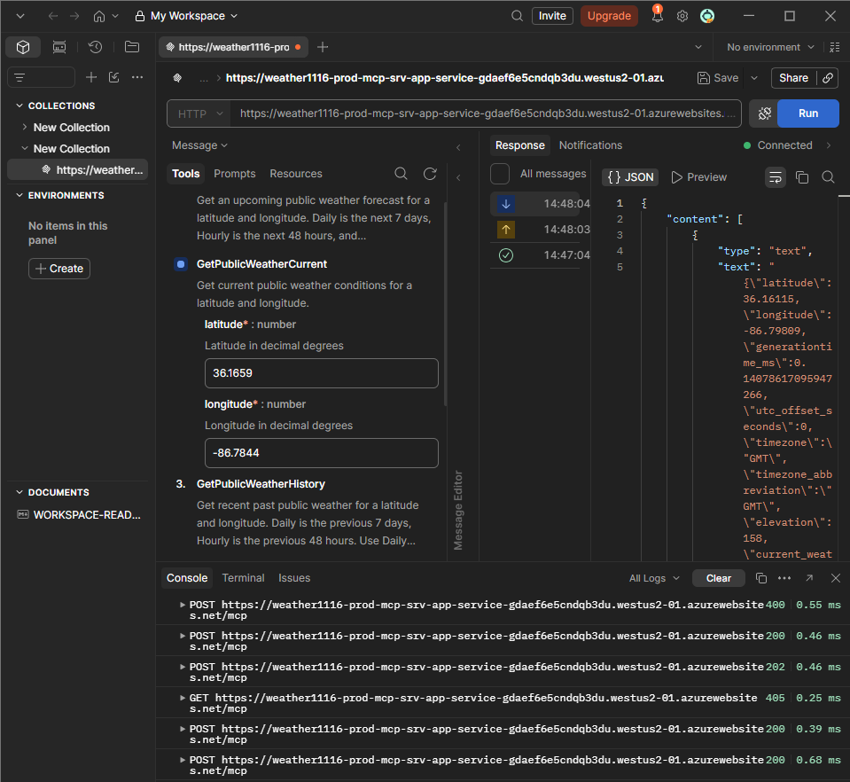

# MCP Inspection

How to poke at this repo's two remote MCP hosts (`mcp-srv-app-service`,
`mcp-srv-func-app`) directly — outside a chat tab or Foundry console — with
the MCP Inspector, MCP Playground, Postman, and curl.

## MCP 2026-07-28 vs Legacy

* [MCP spec changelog — 2026-07-28](https://modelcontextprotocol.io/specification/2026-07-28/changelog)
* [MCP stateless 2026 release candidate](https://mcpplaygroundonline.com/blog/mcp-stateless-2026-release-candidate)
* [MCP 2026-07-28: the big architectural shift](https://securityboulevard.com/2026/08/mcp-2026-07-28-the-big-architectural-shift)

`mcp-srv-app-service` already runs in **stateless** mode
(`WithHttpTransport(options => options.Stateless = true)` in
[`Program.cs`](../../mcp-srv-app-service/mcp/Program.cs)) — no session
required across requests, no server-initiated SSE stream. That is why a
`GET /mcp` returns `405` in the Postman console below: stateless HTTP
transport only accepts `POST`. Keep that in mind when comparing behavior
against the legacy (stateful, session-and-SSE) transport described in the
links above.

## MCP Inspection

### MCP Inspector

* [`modelcontextprotocol.io/docs/2026-07-28/tools/inspector`](https://modelcontextprotocol.io/docs/2026-07-28/tools/inspector)

```bash
npx @modelcontextprotocol/inspector
```

Point it at:

* Local `mcp-srv-app-service` — `http://localhost:8110/mcp`, header
  `Authorization: Bearer <MCP_SRV_APP_SERVICE_KEY>`
* Local `mcp-srv-func-app` — `http://localhost:8120/runtime/webhooks/mcp`,
  header `x-functions-key: <mcp_extension system key>`
* Prod hosts — see [`docs/architecture.md`](../architecture.md#mcp-tool-hosts)
  for the production URLs and auth headers

### MCP Playground

* [`mcpplaygroundonline.com/mcp-test-server`](https://mcpplaygroundonline.com/mcp-test-server)

Same idea as the Inspector — a hosted, no-install way to connect to an MCP
endpoint, list its tools, and call one, when you'd rather not run `npx`
locally.

### Postman

Add a request to a Postman collection pointed at the `/mcp` endpoint (local
`http://localhost:8110/mcp`, or a prod host such as
`https://weather1116-prod-mcp-srv-app-service-<slot>.westus2-01.azurewebsites.net/mcp`):

* Method **POST**, header `Authorization: Bearer <MCP_SRV_APP_SERVICE_KEY>`
* Body → raw JSON, a JSON-RPC request, e.g. `tools/call` for
  `GetPublicWeatherCurrent` with `latitude`/`longitude` arguments
* Postman renders the tools list under the **Tools** tab (once a collection
  is generated from the MCP endpoint) and the JSON-RPC result under
  **Response**



The **Console** tab in the screenshot above shows the request sequence
against the stateless endpoint: an initial `POST` failing (`400`) before the
session handshake, the `initialize` `POST` succeeding (`200`), a
notification accepted (`202`), a `GET` rejected (`405` — no SSE stream in
stateless mode), and the `tools/call` `POST`s for
`GetPublicWeatherCurrent`/`GetPublicWeatherHistory` returning `200` with the
tool's JSON content.

> The screenshot referenced above (`postman-mcp-tools.png`) still needs to
> be added to this folder — see the note at the end of this doc.

### curl

Local `mcp-srv-app-service` (Bearer token):

```bash
curl -s http://localhost:8110/mcp \
  -H "Authorization: Bearer $MCP_SRV_APP_SERVICE_KEY" \
  -H "Content-Type: application/json" \
  -H "Accept: application/json, text/event-stream" \
  -d '{
    "jsonrpc": "2.0",
    "id": 1,
    "method": "tools/call",
    "params": {
      "name": "GetPublicWeatherCurrent",
      "arguments": { "latitude": 36.1659, "longitude": -86.7844 }
    }
  }'
```

Local `mcp-srv-func-app` (Functions system key):

```bash
curl -s "http://localhost:8120/runtime/webhooks/mcp" \
  -H "x-functions-key: $MCP_SRV_FUNC_APP_KEY" \
  -H "Content-Type: application/json" \
  -H "Accept: application/json, text/event-stream" \
  -d '{
    "jsonrpc": "2.0",
    "id": 1,
    "method": "tools/call",
    "params": {
      "name": "GetLatLong",
      "arguments": { "location": "Nashville, TN" }
    }
  }'
```

Swap in a prod URL/key from [`docs/architecture.md`](../architecture.md#mcp-tool-hosts)
to hit the deployed hosts instead of localhost. `tools/list` (no `params`)
is the quickest way to confirm a host is reachable and which tools it
registered before calling one.

## Related docs

* [`docs/architecture.md`](../architecture.md) — MCP Tool Hosts section: ports, endpoints, auth headers, prod URLs
* [`docs/5-chat-clients/5-chat-clients.md`](../5-chat-clients/5-chat-clients.md) — Chat1b/Chat2b/Chat3 remote-MCP usage
* [`docs/presentation.md`](../presentation.md) — talk index
