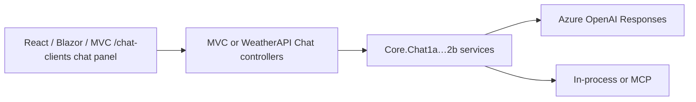
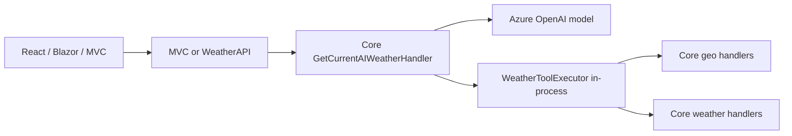

# Site Architecture

## Purpose

This sample demystifies Foundry, agents, and models: from model-direct, to
local in-process looping, to remote MCP, to a hosted agent, behind a pin map.

This repository is a Weather sample app implemented across seven runnable
stacks plus one shared .NET class library.

Six of those projects are primary: five runnable applications (React UI,
Blazor UI, MVC UI, API, and Worker) plus the shared `Core` class library.
The goal is feature parity across all UI implementations while keeping each
project idiomatic for its framework.

The remaining two runnable stacks are the **MCP tool hosts**. The UIs never
call them directly, and neither does Current AI Weather —
`GetCurrentAIWeatherHandler` resolves geo/weather tools in-process (V3
pattern). The MCP hosts remain required for the Chat1b/Chat2b remote-MCP chat
tabs. The **Foundry console demos** are local learning apps on the same
`Core` weather and geo logic, plus the hosted-agent contrast in Foundry
Console V5.

## Projects

### Deployable applications and shared library

| # | Project | Path | Stack | Role |
| - | --- | --- | --- | --- |
| 1 | React UI | [`ui-react`](../ui-react) | React + Vite | Client-rendered single-page app |
| 2 | Blazor UI | [`ui-blazor/blazor`](../ui-blazor/blazor) | Blazor | Interactive server-rendered UI in C# |
| 3 | MVC UI | [`mvc-dotnet/mvc`](../mvc-dotnet/mvc) | ASP.NET Core MVC | Server-rendered web UI |
| 4 | API | [`api-dotnet/api`](../api-dotnet/api) | ASP.NET Core Minimal API | JSON API consumed by React and Blazor UI |
| 5 | Worker | [`worker-dotnet/worker`](../worker-dotnet/worker) | Hangfire dashboard and servers | Hangfire job servers, dashboard (`/hangfire`), and `/About` health leaf |
| 6 | Core | [`core-dotnet/core`](../core-dotnet/core) | .NET class library | In API, MVC, Worker, and MCP |

### Adjacent projects (not UI/API dependencies)

Foundry consoles are learning demos, not UI dependencies. MCP hosts are not
called by the UIs directly, and they are **not** on the Current AI Weather
path either — `GetCurrentAIWeatherHandler` resolves tools in-process (V3).
They remain required for the Chat1b/Chat2b remote-MCP chat tabs. Hello and
map chrome do not need them.

| Project | Path | Role |
| --- | --- | --- |
| MCP Server on App Service | [`mcp-srv-app-service/mcp`](../mcp-srv-app-service/mcp) | Remote MCP server exposing `GetPublicWeatherCurrent`, `GetPublicWeatherForecast`, and `GetPublicWeatherHistory` via `Core` |
| MCP Server on Function App | [`mcp-srv-func-app/mcp`](../mcp-srv-func-app/mcp) | Azure Functions MCP host exposing `GetLatLong` via `Core` |
| Foundry Console V1–V5 | [`FoundryConsoleV1`](../FoundryConsoleV1) … [`V5`](../FoundryConsoleV5) | Local learning demos for Foundry / agent patterns (in `Weather.sln` as `FoundryConsoleV1ModelDirectLegacy`–`V5Agent`; built in CI) |

Ports for runnable apps are in [`README.md`](../README.md); worker and console
auth/env details are in this doc and each project's `.env.example`.

## Runtime Model

- React UI and Blazor UI consume `WeatherAPI`.
- `WeatherAPI` provides hello and AI weather data for React UI and Blazor UI.
- MVC UI does not consume `WeatherAPI` for AI weather/hello; it duplicates the
  equivalent backend logic locally via `Core`.
- Backend logic is intentionally duplicated in MVC and API (no shared backend
  dependency between those projects), except for shared cross-cutting code
  (events/handlers) provided by `Core`, which both MVC and API reference.
- **MCP hosts are not called by any UI, and are not on the Current AI Weather
  path.** `GetCurrentAIWeatherHandler` resolves its `GetLatLong` and
  `GetPublicWeatherCurrent` tools in-process (V3 pattern, see below); the MCP
  hosts remain required only for the Chat1b/Chat2b remote-MCP chat tabs.

## AI Weather and Foundry

All three UIs expose **Current AI Weather**. The request path differs by stack:

- **React / Blazor** → `WeatherAPI` (`/AIWeather/Current`)
- **MVC** → local `HomeController` + `Core` (same handler, no API hop)
- Tools (`GetLatLong`, `GetPublicWeatherCurrent`) run in-process via the
  shared `WeatherToolDefinitions`/`WeatherToolExecutor` helpers (V3 pattern) — no
  network hop to the MCP hosts.

## Chat Clients (Chat1a–Chat2b)

Separate from **Current AI Weather**. All three UIs expose a chat panel on `/chat-clients` with four tabs:

| Tab | Stack | Tools |
| --- | --- | --- |
| Chat1a | Responses API | In-process (V3) |
| Chat1b | Responses API | Remote MCP (V4) |
| Chat2a | Agent Framework | In-process |
| Chat2b | Agent Framework | Remote MCP |

- **React / Blazor** → `POST /Chat1a/messages` … `/Chat2b/messages` on Weather API (SSE stream)
- **MVC** → same routes locally via `Chat1aController` … `Chat2bController` + Core services

Full detail: [`docs/5-chat-clients/5-chat-clients.md`](5-chat-clients/5-chat-clients.md)



## AI Weather handler (production path)



Required settings for API/MVC in production are listed under
[Foundry Console Demos (learning path)](#foundry-console-demos-learning-path) below.
See deploy workflows and `.env.example` files under `api-dotnet/api`,
`mvc-dotnet/mvc`, `ui-blazor/blazor`, and `worker-dotnet/worker`.

## MCP Tool Hosts

Ultra-simple remote MCP servers that expose `Core` tools over the Model Context
Protocol. They exist so a Foundry project (or MCP Inspector) can call the same
MediatR handlers the sample uses in-process elsewhere.

| Host | Path | Tool | Port | Endpoint | Auth |
| --- | --- | --- | --- | --- | --- |
| MCP Server on App Service | [`mcp-srv-app-service/mcp`](../mcp-srv-app-service/mcp) | `GetPublicWeatherCurrent`, `GetPublicWeatherForecast`, `GetPublicWeatherHistory` | 8110 | `/mcp` | Bearer `MCP_SRV_APP_SERVICE_KEY` (no default — must be set by developer) |
| MCP Server on Function App | [`mcp-srv-func-app/mcp`](../mcp-srv-func-app/mcp) | `GetLatLong`, `GetLocation` | 8120 | `/runtime/webhooks/mcp` (Azure) | Functions system key `mcp_extension` (`x-functions-key` header) |

VS Code launch configs: **WeatherMcpSrvAppService**, **WeatherMcpSrvFuncApp**. Ports are
also forwarded in [`.devcontainer/devcontainer.json`](../.devcontainer/devcontainer.json).

Prod apps: `weather1116-prod-mcp-srv-app-service`, `weather1116-prod-mcp-srv-func-app`
(`weather1116-prod-mcp-srv-app-service-gdaef6e5cndqb3du.westus2-01.azurewebsites.net`,
`weather1116-prod-mcp-srv-func-app-b3a6f0cmhqcya3bw.westus2-01.azurewebsites.net`; see
`prod-deploy-mcp-*.yml`).

Auth examples:

- MCP Server on App Service: `Authorization: Bearer {your MCP_SRV_APP_SERVICE_KEY value}` (`/About` stays open)
- MCP Server on Function App (Azure): `x-functions-key: {mcp_extension system key from App keys}` (`/About` is anonymous)

Each host also exposes an anonymous **`/About`** probe that returns a leaf
`AboutNode` (`mcp-srv-app-service` or `mcp-srv-func-app`) with tool-registration health and
optional `BUILD_NUMBER` / `BUILD_START` / `BUILD_BRANCH_NAME` metadata.

API and MVC `/About` aggregate those remote nodes as children under their
`API Root` subtree (see [About and health](#about-and-health)). Production base
URLs are configured via `MCP_SRV_APP_SERVICE_URL`, `MCP_SRV_FUNC_APP_URL`, and
`WORKER_DOTNET_URL` (GitHub variables `PROD_MCP_SRV_APP_SERVICE_URL`,
`PROD_MCP_SRV_FUNC_APP_URL`, `PROD_WORKER_DOTNET_URL`); `/About` is appended in code.

## Background Worker (Hangfire)

[`worker-dotnet/worker`](../worker-dotnet/worker) is the only host that runs
Hangfire job servers against shared storage (`DB_CONNECTION_STRING`, SQL Server
in production). API and MVC register the same storage as Hangfire **clients**
so they can enqueue jobs without running servers; the worker processes them.

| Project | Path | Role | Port | Endpoint |
| --- | --- | --- | --- | --- |
| Worker DotNet | [`worker-dotnet/worker`](../worker-dotnet/worker) | Hangfire dashboard and servers | 8130 | `/hangfire` (POC — no auth), `/About` |

- **Dashboard:** `/hangfire` on the worker (POC — open to all; auth TBD).
- **Health:** `/About` returns `Worker Root` with `worker-dotnet` and a `Hangfire`
  child. The Hangfire node exposes queue counts in `publicMessage` and marks
  itself unhealthy when failed jobs exist or jobs exceed staleness thresholds
  (default 30 minutes processing / 60 minutes enqueued; configure via
  `HangfireAboutHealth_StaleProcessingMinutes` and
  `HangfireAboutHealth_StaleEnqueuedMinutes` in `appsettings.json` or `.env`).
  API and MVC probe this tree as the `Worker Root` child via
  `WORKER_DOTNET_URL` (GitHub variable `PROD_WORKER_DOTNET_URL`; `/About` is
  appended in code).
- **Local dev:** without `DB_CONNECTION_STRING`, each process uses in-memory
  storage; jobs do not cross apps until a shared database is configured.
- **Production:** set `DB_CONNECTION_STRING` to the same Azure SQL connection
  string on the worker, API, and MVC. Prod app: `weather1116-prod-worker`
  (see `prod-deploy-worker-app-service.yml`).

## About and Health

Every runnable app can participate in a shared **About tree** contract
(`Core.About.AboutNode`): `name`, `publicMessage`, `isHealthy`, build metadata,
and `children`.

## Core Project

`Core` (`core-dotnet/core`) is a .NET class library referenced by
`WeatherMVC`, `WeatherAPI`, `worker-dotnet`, and both MCP hosts. It hosts shared MediatR events
and handlers, including:

- `core-dotnet/core/HelloWorld/` — hello-world demo (`HelloWorldEvent`, `HelloWorldHandler`)
- `core-dotnet/core/Geo/` — geocoding (`GetLatLong`)
- `core-dotnet/core/Weather/` — public weather (`GetPublicWeatherCurrent`, `GetPublicWeatherForecast`, `GetPublicWeatherHistory`), fetched in Open-Meteo's native metric units (°C, km/h, mm) for the AI/MCP tool path. The `WeatherMVC`/`WeatherAPI` Forecast and History HTTP endpoints instead go through `GetUIWeatherForecast`/`GetUIWeatherHistory`, which wrap the same metric fetch and map it via `WeatherResponseMapper` into US customary units (°F, mph, in) so the UIs only format values, not convert them.
- `core-dotnet/core/AIWeather/` — model-direct AI weather (`GetCurrentAIWeatherHandler`)
- `core-dotnet/core/About/` — About tree builder and remote about client

## Feature Parity Contract

Parity is **behavioral/feature parity only**: the three UI projects (MVC, React,
Blazor) expose the same routes, pages, features, data, and interactions. They are
**not** required to look alike — each is styled independently (no shared CSS,
config, or components):

| UI | Styling / component library |
| --- | --- |
| React (`ui-react`) | Tailwind CSS v4 (`@tailwindcss/vite`) + shadcn/ui (Radix primitives) + lucide-react |
| Blazor (`ui-blazor`) | Fluent UI Blazor |
| MVC (`mvc-dotnet`) | Hand-written CSS + vanilla JS ([`mvc-dotnet/README.md`](../mvc-dotnet/README.md)) |

Each UI is implemented as if it were a standalone repo: they share **no** CSS,
component source, or frontend toolchain. Bootstrap is not used anywhere.

For backend changes, keep MVC and API implementations aligned by duplicating
equivalent backend logic in both projects.

For UI changes, keep MVC, React, and Blazor aligned on behavior — same routes,
same data, same interactions — by duplicating equivalent behavior in all three.

It is acceptable (and expected) for the UIs to repeat equivalent frontend models
and layout code instead of sharing it.

### Pages and routes (all three UIs)

| Route | Contents |
| --- | --- |
| `/` | Top bar (logo left, person/avatar menu right) above a full-viewport Google Map. Pin click opens a weather modal (Current AI Weather, forecast, and history). |
| `/hello-world` | Same top bar, then the hello message — no map |
| `/current-ai-weather` | Same top bar, then the Current AI Weather widget — no map |
| `/chat-clients` | Same top bar, then the chat clients (ChatPanel) — no map |

The avatar menu is a filled person silhouette (`avatar.svg` in all three UIs)
and its items are ordered:
**Home** → divider →
**Hello World** (`/hello-world`) → **Current AI Weather**
(`/current-ai-weather`) → **Chat Clients** (`/chat-clients`) → divider →
**Light** / **Dark** / **System** (theme) → divider →
**About** (dialog/modal).

## Theme contract

All three UIs expose the same Light / Dark / System preference in the avatar
menu. React labels that group **Theme**; Blazor and MVC mark the selected item
with a checkmark. The choice is stored in `localStorage` (`weather-theme`) per
origin and defaults to **System** (`prefers-color-scheme`). The resolved theme
applies to chrome, content pages, chat, About, the Google Map canvas, pins, and
the pin hover card. Each UI implements this with its own tokens (Tailwind/shadcn
in React, Fluent `DesignThemeModes` plus custom CSS variables in Blazor,
`:root` / `html.dark` variables in MVC).

## Responsive Design Contract

All three UI projects (MVC, React, Blazor) are built to be responsive: each
site must render cleanly from small mobile browser widths (~320px) up through
full desktop/full-screen widths, without relying on a separate mobile-only
experience.

Responsive behavior is satisfied per library (Tailwind flex/grid in React, Fluent
layout/`FluentGrid` in Blazor, semantic CSS flex/grid in MVC). The visual result
differs by library; the behavior does not:

- A single fluid layout adapts at breakpoints rather than branching into
  distinct mobile/desktop templates.
- Primary navigation is a top bar with the logo on the left and the person menu
  on the right; it stays reachable and never overflows the viewport.
- On `/`, the map fills the remaining viewport height below the top bar at every
  width; on `/hello-world`, `/current-ai-weather`, and `/chat-clients` content is
  centered with a max width on large screens.
- Multi-value blocks (e.g. AI weather stats) collapse to a single column on
  small screens and expand into a grid at larger breakpoints.

## Google Maps

Each UI shows a Google Map with sample city pins (New York, Toronto,
Atlanta, Charlotte) filling the landing page (`/`) below the top bar. Pins
use a filled site logo (`logo-solid.svg` / `logo-black-solid.svg`) with no
city-name label on the map; names appear on the hover card. Logos slowly
spin. Google's built-in type control (top-left) offers the four native map
types: **Map** (themed roadmap), **Satellite**, **Hybrid**
(satellite with labels), and **Terrain**. Only Map renders the site's JSON
styling (Satellite/Hybrid/Terrain show real imagery), so the default type
follows the resolved theme: **Hybrid** for Light, **Map** for Dark. If the
user explicitly picks a type from the control, that choice is kept across
Light/Dark/system theme changes; otherwise the default is re-derived from
the resolved theme on every switch (and on initial load). The map canvas,
logo contrast, and hover card follow the resolved Light/Dark theme. Header
chrome keeps the outline `logo.svg`. Clicking a pin opens a weather modal with
Current AI Weather plus forecast and history tabs. Map-canvas weather overlays
are out of scope.

**API to enable:** [Maps JavaScript API](https://console.cloud.google.com/google/maps-apis/api-list)
in a Google Cloud project.

**API key:** Create a browser key in Google Cloud Console → APIs & Services →
Credentials. Restrict it by HTTP referrer (e.g. `http://localhost:3000/*`,
`http://localhost:8090/*`, `http://localhost:8100/*`, plus your prod hosts).

| UI | Config |
| --- | --- |
| React | `VITE_GOOGLE_MAPS_API_KEY` in `ui-react/.env.local` (see [`ui-react/.env.example`](../ui-react/.env.example)) |
| Blazor | `GOOGLE_MAPS_API_KEY` in `ui-blazor/blazor/appsettings.json`, or env `GOOGLE_MAPS_API_KEY` (see [`ui-blazor/blazor/.env.example`](../ui-blazor/blazor/.env.example)) |
| MVC | `GOOGLE_MAPS_API_KEY` in `mvc-dotnet/mvc/appsettings.json`, or env `GOOGLE_MAPS_API_KEY` (see [`mvc-dotnet/mvc/.env.example`](../mvc-dotnet/mvc/.env.example)) |

Without a key, the map container still renders and each UI shows a short
setup hint. Pin hover cards are only created when Maps loads.

## Local Run Model

The four primary runnable applications are intended to run together in VS Code
via Run and Debug **Run All**, using `.vscode/launch.json` and port forwarding
in [`.devcontainer/devcontainer.json`](../.devcontainer/devcontainer.json).

MCP hosts and Foundry consoles are optional for UI development but required to
exercise the full model-direct + MCP path end-to-end. Start `WeatherAPI` (8080) before
React or Blazor when testing API-dependent features.

## Build and CI

The workflow [`build-and-test.yml`](../.github/workflows/build-and-test.yml)
builds on every push:

- `Core.csproj`, `WeatherAPI.csproj`, `WeatherBlazor.csproj`, `WeatherMVC.csproj`,
  `WeatherWorkerDotNet.csproj`, `WeatherMcpSrvAppService.csproj`, `WeatherMcpSrvFuncApp.csproj`,
  and the five Foundry console projects (`FoundryConsoleV1ModelDirectLegacy`–`V5Agent`) via `dotnet build`.
- React app in `ui-react` via `npm ci && npm run build`, followed by
  `npm test -- --run` (Vitest).
- `Core.Tests` unit tests.
- `WeatherAPI.Tests` integration tests.
- `WeatherMVC.Tests` integration tests.
- `WeatherWorkerDotNet.Tests` unit tests.
- `WeatherBlazor.Tests` component tests.
- `WeatherMcpSrvAppService.Tests` and `WeatherMcpSrvFuncApp.Tests` About/tool-registration tests.

Production deploy workflows (`prod-deploy-*.yml`) auto-deploy when **build-and-test**
completes successfully on `main`. Each deploy workflow can also be triggered manually
via `workflow_dispatch` on any branch. Deployables include API, MVC, React, Blazor,
worker-dotnet, and both MCP hosts.

## Repository Layout

```text
api-dotnet/
  api/                       API project (WeatherAPI.csproj)
  api.tests/                 API unit tests (WeatherAPI.Tests.csproj)
mvc-dotnet/
  mvc/                       MVC UI project (WeatherMVC.csproj)
  mvc.tests/                 MVC integration tests (WeatherMVC.Tests.csproj)
ui-blazor/
  blazor/                    Blazor UI project (WeatherBlazor.csproj)
  blazor.tests/              Blazor unit tests (WeatherBlazor.Tests.csproj)
ui-react/                    React UI project
core-dotnet/
  core/                      Core shared class library (Core.csproj)
  core.tests/                Core unit tests (Core.Tests.csproj)
worker-dotnet/
  worker/                    Hangfire background worker (WeatherWorkerDotNet.csproj)
  worker.tests/              Worker unit tests (WeatherWorkerDotNet.Tests.csproj)
mcp-srv-app-service/
  mcp/                       MCP Server on App Service tool host (WeatherMcpSrvAppService.csproj)
  mcp.tests/                 MCP Server on App Service tests (WeatherMcpSrvAppService.Tests.csproj)
mcp-srv-func-app/
  mcp/                       MCP Server on Function App tool host (WeatherMcpSrvFuncApp.csproj)
  mcp.tests/                 MCP Server on Function App tests (WeatherMcpSrvFuncApp.Tests.csproj)
FoundryConsoleV1…V5/         Foundry learning console demos
docs/                        Documentation (including this file)
```

## Foundry Console Demos (learning path)

Five standalone console apps demonstrate how the production AI weather path was
built up, plus **V5** as a hosted-agent contrast. They are **training building
blocks**, not production deployables:

| Console | Pattern taught |
| --- | --- |
| **V1** | Model-direct via legacy `AzureOpenAIClient` / Cognitive Services endpoint |
| **V2** | Model-direct via `ResponsesClient` against the unified AI services endpoint |
| **V3** | Model-direct: tools handled by local in-process looping (`GetLatLong`, `GetLocation`, `GetPublicWeatherCurrent`, `GetPublicWeatherForecast`, `GetPublicWeatherHistory`) — same Core code reused in the tools; also the production pattern in `GetCurrentAIWeatherHandler` (API/MVC) |
| **V4** | Model-direct: tools handled by remote MCP servers — still used by the Chat1b/Chat2b remote-MCP chat tabs |
| **V5** | Hosted Foundry Agent owns the instructions, response schema, and MCP tools; console sends only the user prompt |

Run from VS Code or `dotnet run` in each folder. Settings use the
`AZURE_FOUNDRY_PROD_EUS2_*` prefix (see each `Program.cs` and `.env.example`).

**V4 settings** (in addition to `AZURE_FOUNDRY_PROD_EUS2_KEY`):

| Variable | Required | Purpose |
| --- | --- | --- |
| `MCP_SRV_FUNC_APP_KEY` | Yes | `mcp_extension` system key for the `McpSrvFuncApp` server (`x-functions-key`) |
| `MCP_SRV_APP_SERVICE_KEY` | Yes | Bearer token for the `McpSrvAppService` server |

**API/MVC AI weather settings** (same pattern as V3 — tools run in-process,
no MCP host required for this feature):

| Variable | Required | Purpose |
| --- | --- | --- |
| `AZURE_FOUNDRY_PROD_EUS2_PROJ_URL` | Yes | Foundry project URL or OpenAI endpoint URL (e.g. `.../api/projects/{id}` or `.../openai/v1`; handler appends `/openai/v1` when missing) |
| `AZURE_FOUNDRY_PROD_EUS2_KEY` | Yes | Microsoft Foundry API key |
| `AZURE_FOUNDRY_PROD_EUS2_MODEL` | Yes | Hosted model deployment name (e.g. `gpt-5.4-mini`) |

`MCP_SRV_FUNC_APP_*` and `MCP_SRV_APP_SERVICE_*` are no longer needed for AI
Weather; they're still required if the Chat1b/Chat2b remote-MCP chat tabs are
used (see [`docs/5-chat-clients/5-chat-clients.md`](5-chat-clients/5-chat-clients.md)).

**V5 settings** (agent-hosted demo only):

| Variable | Required | Purpose |
| --- | --- | --- |
| `AZURE_FOUNDRY_PROD_EUS2_PROJ_URL` | Yes | Foundry project URL, e.g. `https://wx1116-prd-res-eu2.services.ai.azure.com/api/projects/wx1116-prd-prj-eu2` |
| `AZURE_FOUNDRY_PROD_EUS2_AGENT_NAME` | No | Defaults to `wx1116-agent-default` (project default version) |
| `AZURE_FOUNDRY_PROD_EUS2_KEY` | Yes | Same API key as V1–V3 |

Suggested reading order: V1 → V2 → V3 → `GetCurrentAIWeatherHandler` in
`core-dotnet/core/AIWeather` (the production V3-pattern handler) → V4 → V5
(hosted-agent contrast).
