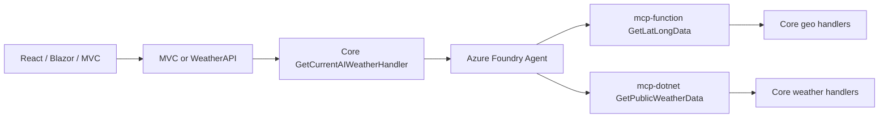

# Site Architecture

## Purpose

This repository contains one Weather sample implemented as five primary
projects: four runnable applications plus one shared .NET class library. The
goal is feature parity across all UI implementations while keeping each project
idiomatic for its framework.

The repo also includes **MCP tool hosts** and **Foundry console demos** that
are not called directly by the UIs, but they exercise the same `Core` weather
and geo logic and support the hosted **Azure Foundry agent** used for Current
AI Weather in API and MVC.

## Projects

### Deployable applications and shared library

| # | Project | Path | Stack | Role |
| - | --- | --- | --- | --- |
| 1 | MVC UI | [`mvc-dotnet/WeatherMVC`](../mvc-dotnet/WeatherMVC) | ASP.NET Core MVC | Server-rendered web UI |
| 2 | API | [`api-dotnet/WeatherAPI`](../api-dotnet/WeatherAPI) | ASP.NET Core Minimal API | JSON API consumed by React and Blazor UI |
| 3 | React UI | [`ui-react`](../ui-react) | React + Vite | Client-rendered single-page app |
| 4 | Blazor UI | [`ui-blazor/WeatherBlazor`](../ui-blazor/WeatherBlazor) | Blazor Server | Interactive server-rendered UI in C# |
| 5 | Core | [`core-dotnet/Core.csproj`](../core-dotnet/Core.csproj) | .NET class library | Shared events/handlers referenced by MVC, API, and MCP hosts |

### Adjacent projects (not UI/API dependencies)

These are part of the overall system map but are **not** on the critical path
for hello/forecast/map flows in the three UIs.

| Project | Path | Role |
| --- | --- | --- |
| MCP DotNet | [`mcp-dotnet`](../mcp-dotnet) | Remote MCP server exposing `GetPublicWeatherData` via `Core` |
| MCP Function | [`mcp-function`](../mcp-function) | Azure Functions MCP host exposing `GetLatLongData` via `Core` |
| Foundry Console V1–V4 | [`FoundryConsoleV1…`](../FoundryConsoleV1ModelDirectLegacyCognitiveServicesEndpoint) … [`V4`](../FoundryConsoleV4MCP) | Local learning demos for Foundry / agent patterns (not in `Weather.sln`) |

Ports, auth, and env vars for MCP and console apps live in [`README.md`](../README.md)
and each project's `.env.example`.

## Runtime Model

- `WeatherAPI` provides forecast data for React UI and Blazor UI.
- React UI and Blazor UI consume `WeatherAPI`.
- MVC UI does not consume `WeatherAPI` for forecast/hello; it duplicates the
  equivalent backend logic locally via `Core`.
- Backend logic is intentionally duplicated in MVC and API (no shared backend
  dependency between those projects), except for shared cross-cutting code
  (events/handlers) provided by `Core`, which both MVC and API reference.
- **MCP hosts are not called by any UI or by `WeatherAPI` for standard
  forecast/hello flows.** They are used indirectly when the hosted Foundry
  agent resolves a place name and fetches weather (see below).

## AI Weather and Foundry Agent

All three UIs expose **Current AI Weather**. The request path differs by stack:

- **React / Blazor** → `WeatherAPI` (`/AIWeather/Current`)
- **MVC** → local `HomeController` + `Core` (same handler, no API hop)

Both API and MVC route AI weather through `Core.AIWeather.Handlers.GetCurrentAIWeatherHandler`,
which calls a **hosted Microsoft Foundry agent** (default `wx1116-agent-default`).
The agent is configured in Azure to use MCP tools that map back to this repo's
`Core` handlers:



Required settings for API/MVC in production: `AZURE_FOUNDRY_PROD_EUS2_PROJ_URL`,
`AZURE_FOUNDRY_PROD_EUS2_KEY`, and optionally `AZURE_FOUNDRY_PROD_EUS2_AGENT_NAME`.
See deploy workflows and `.env.example` files in `api-dotnet` and `mvc-dotnet`.

## MCP Tool Hosts

Ultra-simple remote MCP servers that expose `Core` tools over the Model Context
Protocol. They exist so a Foundry project (or MCP Inspector) can call the same
MediatR handlers the sample uses in-process elsewhere.

| Host | Tool | Endpoint | Auth |
| --- | --- | --- | --- |
| MCP DotNet | `GetPublicWeatherData` | `/mcp` | Bearer `Mcp:ApiKey` / `Mcp__ApiKey` |
| MCP Function | `GetLatLongData` | `/runtime/webhooks/mcp` (Azure) | Functions system key `mcp_extension` |

Each host also exposes an anonymous **`/about`** probe that returns a leaf
`AboutNode` (`mcp-dotnet` or `mcp-function`) with tool-registration health and
optional `BUILD_NUMBER` / `BUILD_START` metadata.

API and MVC `/About` aggregate those remote nodes as children under their
`API Root` subtree (see [About and health](#about-and-health)). Production base
URLs are configured via `MCPDotNetUrl` and `MCPFunctionUrl` (GitHub variables
`PROD_MCP_DOTNET_URL`, `PROD_MCP_FUNCTION_URL`); `/about` is appended in code.

## Foundry Console Demos (learning path)

Four standalone console apps demonstrate how the hosted agent pattern in API/MVC
was built up. They are **training building blocks**, not production deployables:

| Console | Pattern taught |
| --- | --- |
| **V1** | Model-direct via legacy `AzureOpenAIClient` / Cognitive Services endpoint |
| **V2** | Model-direct via `ResponsesClient` against the unified AI services endpoint |
| **V3** | In-process injected function tools (`GetLatLongData`, `GetPublicWeatherData`) — same tools `Core` exposes, handled locally |
| **V4** | Calls the **same hosted Foundry agent** API/MVC use; agent invokes MCP lat/long + weather tools |

Run from VS Code or `dotnet run` in each folder. Settings use the
`AZURE_FOUNDRY_PROD_EUS2_*` prefix (see [`README.md`](../README.md)).

Suggested reading order: V1 → V2 → V3 → V4 → `GetCurrentAIWeatherHandler` in
`core-dotnet/AIWeather`.

## About and Health

Every runnable app can participate in a shared **About tree** contract
(`Core.about.AboutNode`): `name`, `isHealthy`, optional build metadata, and
`children`.

| App | `/about` or `/About` behavior |
| --- | --- |
| MCP DotNet / MCP Function | Leaf node for self; health checks expected MCP tool registration |
| WeatherAPI | `API Root` → `API` + remote MCP about nodes |
| WeatherMVC | `MVC Root` → `MVC` + nested `API Root` (same MCP children as API) |
| React | Fetches API `/About` and wraps with `UI React Root` |
| Blazor | Fetches API `/About` and wraps with `Blazor Root` |

`Core.about.AboutClient` (`IAboutClient`) fetches remote about JSON from
configured URLs. Missing or unhealthy dependencies become unhealthy leaf nodes
without failing the entire response.

## Core Project

`Core` (`core-dotnet/Core.csproj`) is a .NET class library referenced by
`WeatherMVC`, `WeatherAPI`, and both MCP hosts. It hosts shared MediatR events
and handlers, including:

- `core-dotnet/demo/` — hello-world demo (`HelloWorldEvent`, `HelloWorldHandler`)
- `core-dotnet/geo/` — geocoding (`GetLatLongData`)
- `core-dotnet/weather/` — public weather (`GetPublicWeatherData`)
- `core-dotnet/AIWeather/` — Foundry agent integration (`GetCurrentAIWeatherHandler`)
- `core-dotnet/about/` — About tree builder and remote about client

## Feature Parity Contract

For developers and AI agents, parity means the three UI projects (MVC, React,
Blazor) should remain behaviorally aligned from a user perspective.

For backend changes, keep MVC and API implementations aligned by duplicating
equivalent backend logic in both projects.

For UI changes, keep MVC, React, and Blazor implementations aligned by
duplicating equivalent UI behavior in all three projects.

It is acceptable for React and Blazor to repeat equivalent frontend
models instead of sharing code. These projects are intentionally framework-
native and independently maintainable; parity is behavioral and API-contract
based, not enforced through shared frontend model artifacts.

## Responsive Design Contract

All three UI projects (MVC, React, Blazor) are built to be responsive: each
site must render cleanly from small mobile browser widths (~320px) up through
full desktop/full-screen widths, without relying on a separate mobile-only
experience.

Shared responsive conventions kept in parity across the three sites:

- A single fluid layout adapts at breakpoints rather than branching into
  distinct mobile/desktop templates.
- Primary navigation collapses behind a toggle (hamburger) on narrow
  viewports and expands inline (MVC navbar, Blazor sidebar, React top bar) on
  wider viewports.
- The avatar/About menu stays reachable and usable at every width and never
  overflows the viewport.
- The weather forecast table scrolls horizontally within its own container
  (rather than the whole page) on viewports too narrow to show all columns.
- Main content is centered with a max-width on large screens instead of
  stretching to full width, keeping line lengths and table density readable.
- Base typography scales down slightly on small screens and back up at
  tablet/desktop breakpoints for comfortable readability at every size.
- The city map section (Google Maps) appears on the home page of each UI with
  the same sample pins and dark styling; map height stays usable on narrow
  viewports.

## Google Maps

All three UIs embed a Maps JavaScript API map with sample city coordinates.
Configuration:

- React: `VITE_GOOGLE_MAPS_API_KEY` (build-time Vite env)
- Blazor / MVC: `GoogleMapsApiKey` (appsettings or `GoogleMapsApiKey` env)

Pins are static sample data today (ready for weather overlays later).

## Local Run Model

The four primary runnable applications are intended to run together in VS Code
via Run and Debug **Run All**, using `.vscode/launch.json` and port forwarding
in [`.devcontainer/devcontainer.json`](../.devcontainer/devcontainer.json).

MCP hosts and Foundry consoles are optional for UI development but required to
exercise the full agent + MCP path end-to-end. Start `WeatherAPI` (8080) before
React or Blazor when testing API-dependent features.

## Build and CI

The workflow [`build-and-test.yml`](../.github/workflows/build-and-test.yml)
builds on every push:

- `Core.csproj`, `WeatherAPI.csproj`, `WeatherBlazor.csproj`, `WeatherMVC.csproj`,
  `WeatherMcpDotNet.csproj`, and `WeatherMcpFunction.csproj` via `dotnet build`.
- React app in `ui-react` via `npm ci && npm run build`, followed by
  `npm test -- --run` (Vitest).
- `WeatherAPI.Tests` integration tests.

Production deploy workflows (`prod-deploy-*.yml`) run only after **Build and Test**
completes successfully on `main` (or via manual `workflow_dispatch` on `main`).
Deployables include API, MVC, React, Blazor, and both MCP hosts.

## Repository Layout

```text
api-dotnet/WeatherAPI/       API project
mvc-dotnet/WeatherMVC/       MVC UI project
ui-blazor/WeatherBlazor/     Blazor UI project
ui-react/                    React UI project
core-dotnet/                 Core shared class library (Core.csproj)
mcp-dotnet/                  MCP DotNet tool host (GetPublicWeatherData)
mcp-function/                MCP Function tool host (GetLatLongData)
FoundryConsoleV1…V4/         Foundry learning console demos
docs/                        Documentation (including this file)
```
