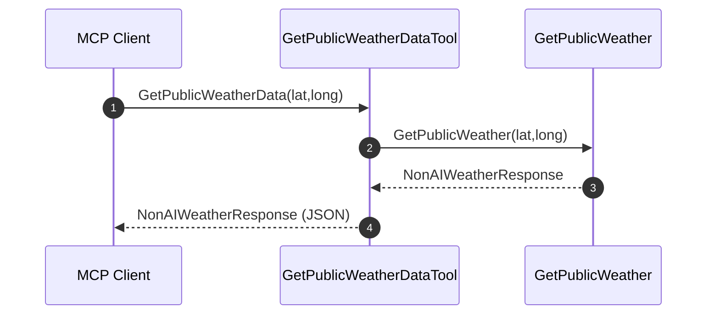
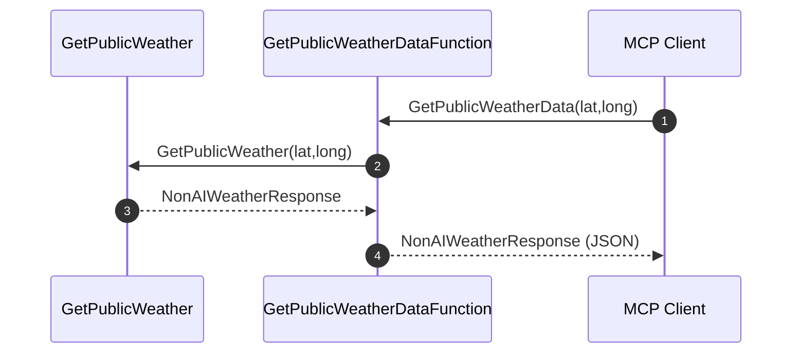

# Quick App Generator / Rapid Prototyping

| Vendor | Project Name | Best For | Tech Stack | Database & Backend | Code Ownership & Export |
| :--- | :--- | :--- | :--- | :--- | :--- |
| **Lovable** | [Lovable.dev](https://lovable.dev) | High-end SaaS MVPs and client-ready web apps | React + Vite + Tailwind CSS | Native Supabase Integration | **Excellent** (Full GitHub sync & clean ZIP export) |
| **Vercel** | [v0.app](https://v0.app/) *(fka v0.dev)* | Pixel-perfect UI engineering and agentic full-stack shipping | Next.js + React + Shadcn UI | Integrated One-Click DBs (Supabase, Neon, Upstash) | **Excellent** (Instant Vercel push, GitHub branch PRs, local CLI pull) |
| **Replit** | [Replit Agent 4](https://replit.com) | Complex backend pipelines, auto-configured servers, and parallel workflows | Node.js, Python (Flask/FastAPI) | Built-in Replit Postgres / Object Storage | **Moderate** (Can export raw code, but architecture relies heavily on Replit) |
| **Totalum** | [Totalum](https://totalum.app) | Full-stack production builds with ready-made architecture out-of-the-box | Next.js + TypeScript | Built-in Postgres, Auth, & Stripe payments | **Excellent** (Zero platform lock-in; exports straight to custom domains) |
| **StackBlitz** | [Bolt.new](https://bolt.new) | Rapid sandboxed frontends and multi-platform mobile mockups | React, Next.js, or Vite + Expo | In-browser WebContainers / External Supabase | **Good** (One-click StackBlitz workspace or instant git push) |
| **FlutterFlow** | [FlutterFlow](https://totalum.app) | Native mobile apps destined for the iOS and Android app stores | Dart + Flutter | Firebase or Supabase | **Excellent** (Directly compiles down to real, downloadable Flutter source code) |
| **Google** | [Google AI Studio](https://google.dev) *(Build Mode)* | Throwaway prototypes, single-page mockups, and quick ideas | Vanilla HTML/CSS/JS or baseline React | None (Client-side mocking only) | **Basic** (Requires manual copy-pasting of isolated code blocks) |

\* Wireframes excluded like: Balsamiq, Figma, Anima, etc

 
 
 

# Developer Centric

| Company | Cloud Version Name | Desktop/CLI Version Name | Current / Supported Models |
| :--- | :--- | :--- | :--- |
| **Anysphere** *(SpaceX)* | Cursor Cloud / Background Agents | **[Cursor IDE](https://cursor.com)** *(Editor)* | **Composer 2.5**, Cursor Tab, Claude (Fable 5 / Opus 4.8), OpenAI (GPT-5.5) |
| **Cognition** | [Devin Cloud](https://devin.ai) | **[Devin Desktop](https://devin.ai)** *(Editor, fka Windsurf)* | **Devin Local Engine**, Cognition SWE 1.6, Claude (Fable 5), OpenAI GPT-5, DeepSeek-R1 |
| **Anthropic** | Claude.ai / Projects | **[Claude Code](https://anthropic.com)** *(Terminal Agent)* | **Claude Fable 5**, Claude Opus 4.8, Claude 3.5 Sonnet |
| **GitHub / Microsoft** | [Copilot Workspace](https://github.com) | **GitHub Copilot** *(IDE Extension)* | OpenAI GPT-5.5, customized GitHub specialized engineering models |
| **Google** | [Google Jules](https://jules.google) *(Async GitHub Agent)* | **[Google Antigravity](https://thenewstack.io)** *(IDE / Agent Command App)* | **Gemini 3.6 Flash** (New Default), Gemini 3.5 Flash-Lite, Gemini 3.5 Flash Cyber |
| **OpenAI** | [Codex in ChatGPT](https://openai.com) / Cloud Tasks | **[OpenAI Codex App](https://openai.com)** *(Desktop, CLI, & Extension)* | **GPT-5.5**, GPT-5, GPT-4o, Custom Agentic Models |

 
 
 

# x

X
