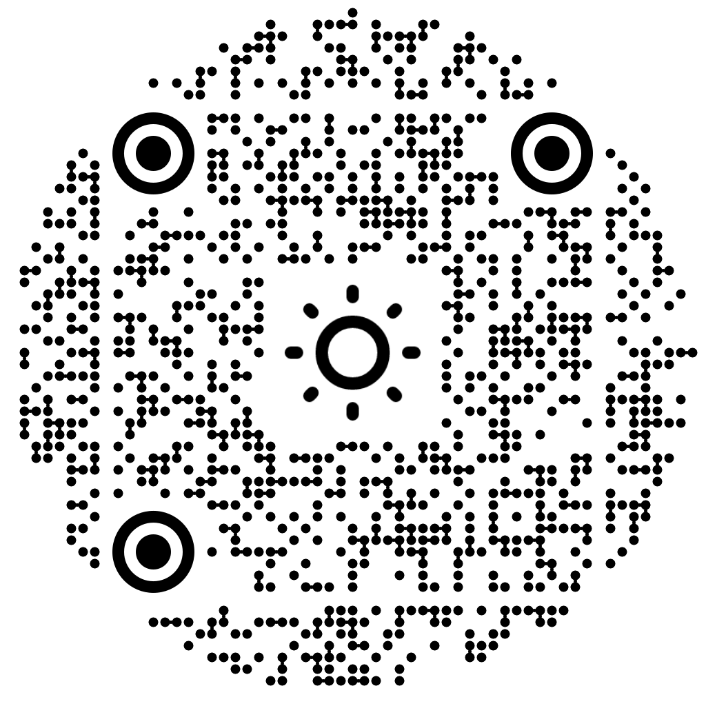

# Presentation: The Journey

  

Sections **1–3** are framing — name them, show the folder, move on. The material is
sketched, not presentation-ready. **Section 4** is the focus: live demos, architecture,
and the Foundry console learning path (V1 → V5).

## Sections

| # | Title | Doc | Role in the talk |
| --- | --- | --- | --- |
| 1 | Laptop-free Engineering | [`laptop-free.md`](1-laptop-free-engineering/laptop-free.md) | Introduce — context for cloud / Codespaces / VPC |
| 2 | Autonomous Sprint Board AI Development | [`autonomous-sprint-board.md`](2-autonomous-sprint-board-ai-development/autonomous-sprint-board.md) | Introduce — placeholder for sprint-board + agents story |
| 3 | AI Development Ecosystem | [`ai-development-ecosystem.md`](3-ai-development-ecosystem/ai-development-ecosystem.md) | Introduce — landscape of tools (wireframes, rapid app gen, IDEs) |
| 4 | Demystifying Microsoft Foundry Agents and MCP | [`demystifying-foundry-agents-mcp.md`](4-demystifying-foundry-agents-mcp/demystifying-foundry-agents-mcp.md), [`brainstorming`](4-demystifying-foundry-agents-mcp/demystifying-model-agent-tools-mcp-brainstorming.md) | **Focus** — Foundry consoles, agents, MCP hosts in this repo |
| 5 | Chat Clients (Chat1a–Chat2b) | [`5-chat-clients.md`](5-chat-clients/5-chat-clients.md) | **Hands-on** — four chat tabs in React/MVC/Blazor |

## Supporting material

- [`architecture.md`](architecture.md) — runtime diagrams, ports, production settings (pair with section 4)
- [`../README.md`](../README.md) — how to run the Weather sample locally or in Codespaces
- [`../AGENTS.md`](../AGENTS.md) — Cursor Cloud / agent environment notes

## Suggested flow (section 4)

1. **Problem** — AI weather needs real lat/long and public weather data, not hallucination.
   - "Nashville TN" is a location
   - `GetLatLongDataEvent(location)` returns Lat/Long
   - `GetPublicWeatherDataEvent(Lat/Long)` returns Non AI Public Weather Data
   - AI returns weather summary
2. **V1 → V2** — model-direct (legacy vs unified endpoint); when the console still owns data prep.
3. **V3** — in-process tool callbacks; model chooses tools, your console answers them.
4. **V4** — model-direct with remote MCP tools; MCP without an agent, and the tool loop disappears.
5. **V5** — hosted Foundry agent demo; agent owns instructions, response schema, and MCP tools; console sends only the user prompt.
6. **Production** — V4 model-direct path in `GetCurrentAIWeatherHandler` (API/MVC).
7. **Demos** — React / Blazor / API `GetCurrentAIWeather`; optional MCP inspector on 8110 / 8120.
8. **Chat clients** — `/chat` in React and Blazor, `/Chat` in MVC; compare Chat1a–Chat2b side by side.

Adjust 1–3 to taste, keep the main pallet focused on 4–6, and finish the menu with hands-on paths in the repo.
